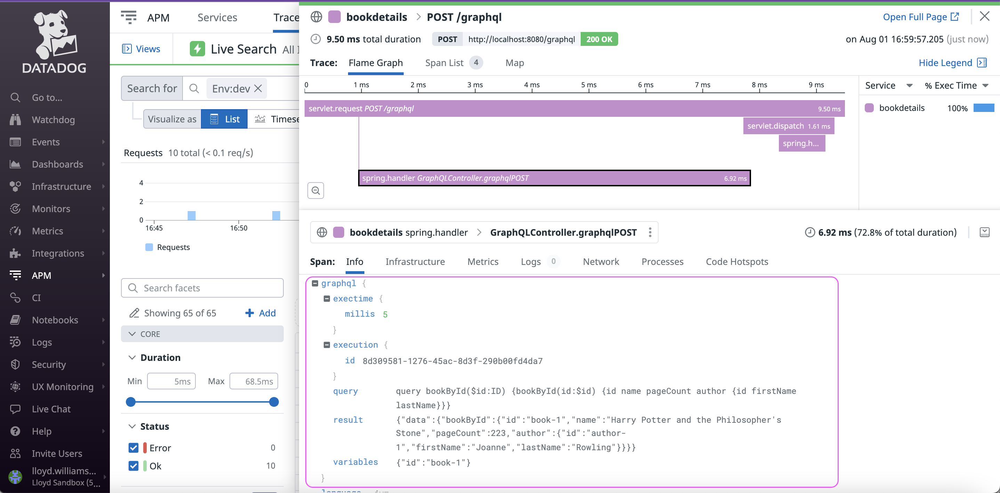
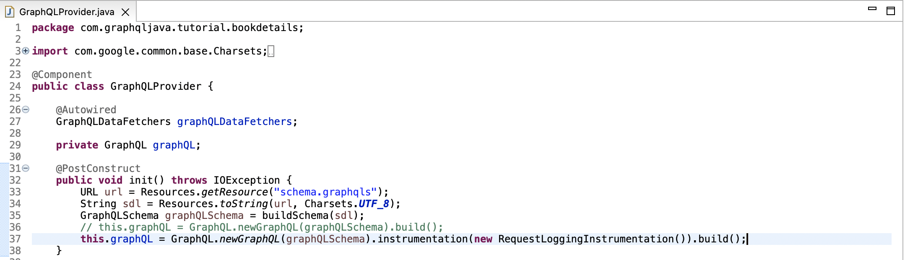
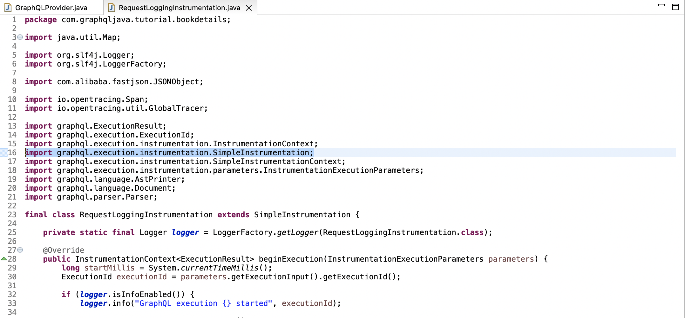
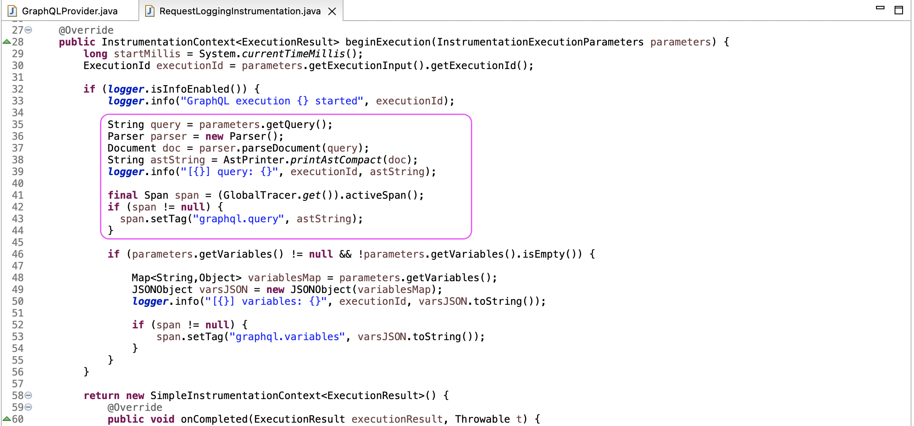
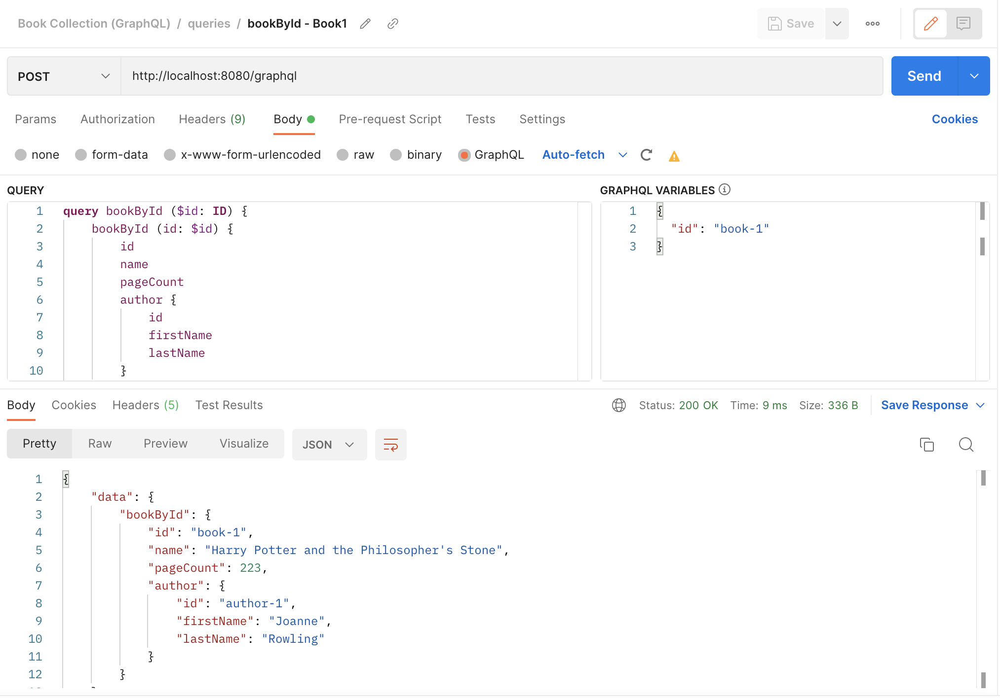

# Datadog Java Springboot with GraphQL

This sample shows how to configure a Java Springboot application so that you can see details about the requests in Datadog. 

It shows the GraphQL query execution time in milliseconds, the execution id, the query and the variables. Normally, you may not want to add the result to the span since it could potentially be very large, but it is shown for illustration purposes for cases where the result will always be very small. 

This is done very easily with the Java Springboot framework by adding an Instrumentation Provider to your GraphQL microservice.

Then supply the class that implements "SimpleInstrumentation".

Within the "SimpleInstrumentation" class, add the code to create custom span tags. 

Please refer to Datadog's documentation for [adding custom span tags in Java](https://docs.datadoghq.com/tracing/trace_collection/custom_instrumentation/java/#add-custom-span-tags) 

