# Simple Datadog Java Tracing Example 

This example illustrates tracing a Java program (using SpringBoot and GraphQL) with Datadog. 

## Set-up

### Datadog Agent

Make sure that the Datadog agent is installed in your environment and is configured for APM and Logs.

See documentation: [Getting Started with the Agent](https://docs.datadoghq.com/getting_started/agent/)

**APM:**

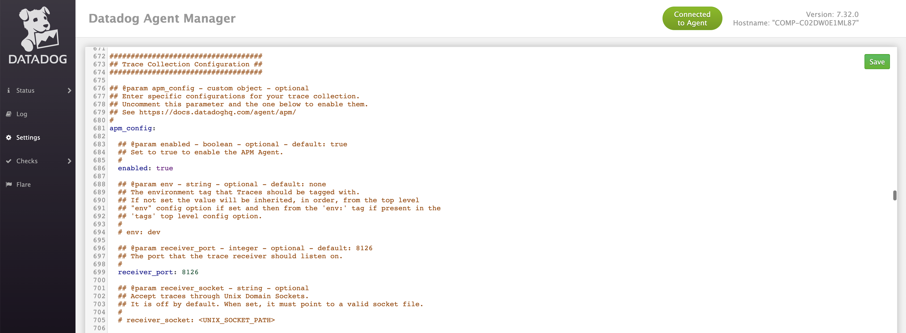

**Logs:**

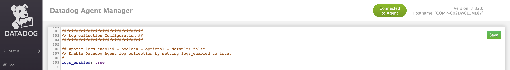

### Datadog Java Trace Library/Agent

Download the Datadog Java Trace Agent. You can use the script (get-new-dd-java-agent.sh) provided or see documentation for full details.

[Tracing Java Applications](https://docs.datadoghq.com/tracing/setup_overview/setup/java)

```
#!/bin/sh
wget -O dd-java-agent.jar https://dtdg.co/latest-java-tracer
```

### Java Program

Download the sample Java program (book-details-0.0.7.jar) and the script to run it. The script should run without any changes required, if Java is installed in your environment and you place the dd-java-agent.jar in the same folder as the book-details-0.0.7.jar.  

If necessary, modify the startup script (run-bookdetails-0.0.7.sh) with the options that you want to use. For example, you may want to modify the values for the tags that are used. For a list of possible values and theirs definitions, please refer to the [Datadog documentation](https://docs.datadoghq.com/tracing/setup_overview/setup/java/?tab=otherenvironments#configuration). 

If the dd-java-agent.jar is in a different folder from the book-details-0.0.7.jar you can modify the script to use the path to the dd-java-agent.jar file.

You can also set the JAVA_HOME inside the script, if needed.

```
export JAVA_HOME=/Library/Java/JavaVirtualMachines/zulu-8.jdk/Contents/Home
${JAVA_HOME}/bin/java -javaagent:/Users/lloyd.williams/u01/datadog/dd-java-agent.jar \
```

### Datadog Agent Config Check for Logs

One additional step is to set-up Datadog to collect your logs. This program will automatically create a logs folder and a log file called (spring-boot-logger.log) in the directory where it is running (e.g. /Users/lloyd.williams/GitHub/lloydwilliams/datadog/apm/java/macos/logs)

Create a folder in the configuration directory (/opt/datadog-agent/etc/conf.d) of the agent for the configuration to collect your logs (e.g. /opt/datadog-agent/etc/conf.d/bookdetails.d)

Create a conf.yaml file as follows with the path to the applications log files (e.g. /Users/lloyd.williams/GitHub/lloydwilliams/datadog/apm/java/logs)

```
logs:
    - type: file
      path: /Users/lloyd.williams/GitHub/lloydwilliams/datadog/apm/java/logs/*.log
      source: java
      service: bookdetails
```

https://docs.datadoghq.com/agent/logs/?tab=tailfiles

### Restart the Agent

After any agent configuration changes, restart the agent. Use the agent manger on Mac OS or [the command specific to your environment](https://docs.datadoghq.com/agent/guide/agent-commands/?tab=agentv6v7#restart-the-agent). 

 

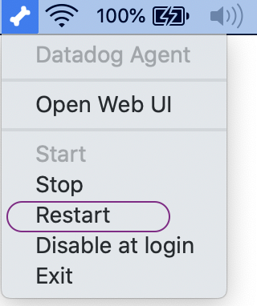


## Start the Application

Open a terminal, and start the Java program by running the script from the command line: 

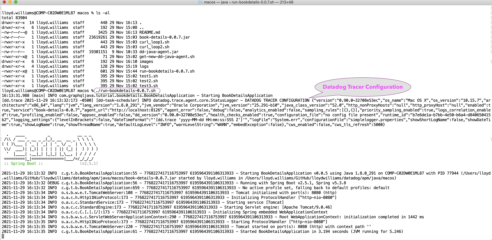

Notice that the Datadog Tracer Configuration should appear in the logs. 

## Testing

Postman is a 3rd party tool for executing APIs which also supports GraphQL. A [postman](https://www.postman.com/) collection was provided for testing that you can import and use to send requests.

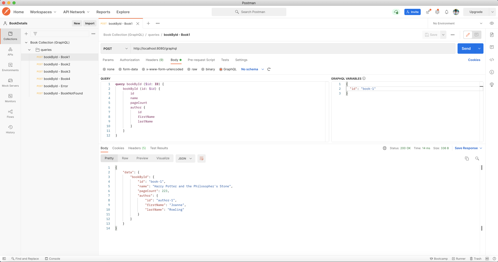

Try sending some of the requests or you can test using the curl scripts provided:

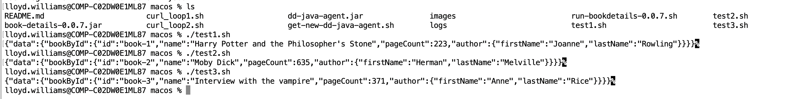

### Datadog APM

Open the [Datadog SaaS UI and goto the APM, Traces](https://app.datadoghq.com/apm/traces) section (i.e. https://app.datadoghq.com/apm/traces):

You should see some traces:

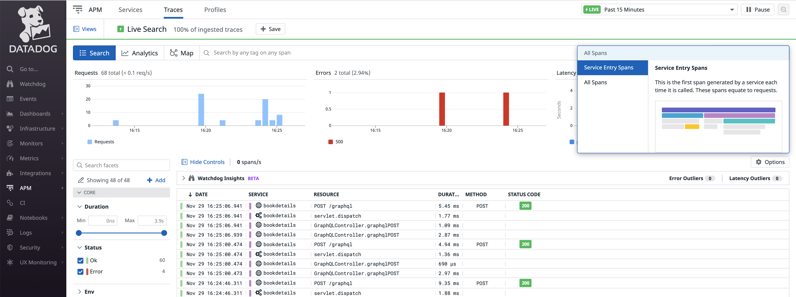

Change the search to only see "Service Entry Spans".

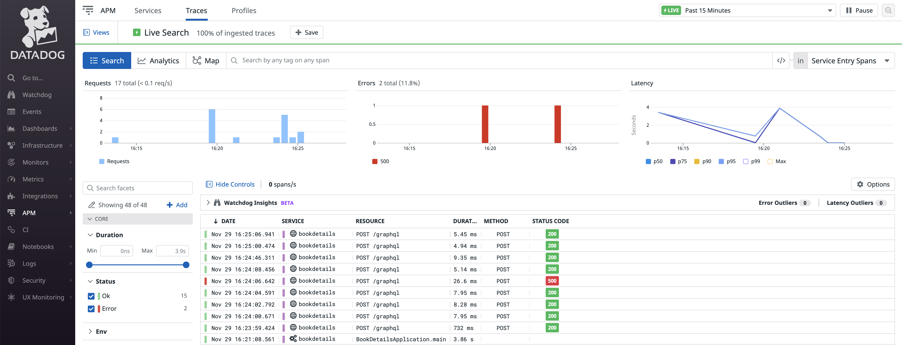

Click on one of the traces that have a Resouce called "POST /graphql" to view the details of the trace:

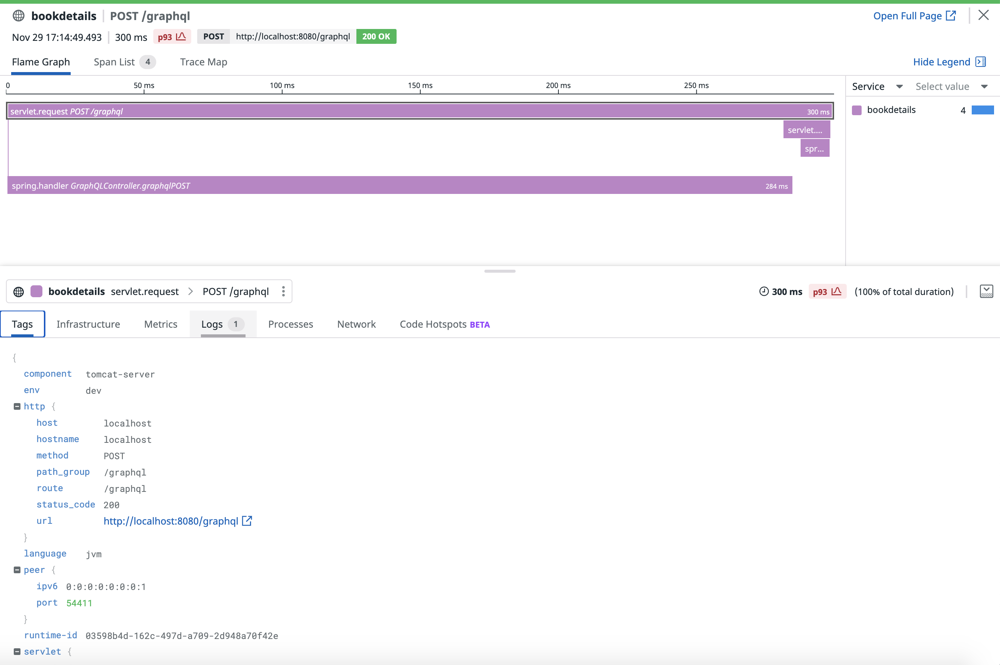

Notice that you can click on the Logs tab and see that the logs are correlated with the traces. This is because we used the parameter dd.logs.injection=true when starting up the Java application which injected the traces into the logs.

```
-Ddd.logs.injection=true
```

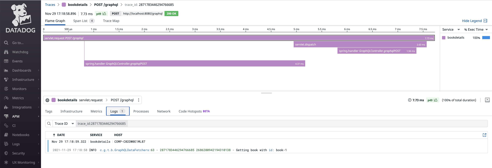

Also go to the logs to see the [Live Tail](https://app.datadoghq.com/logs/livetail) of the logs:

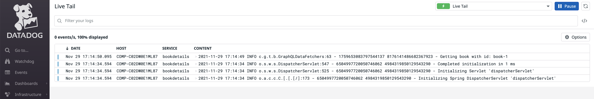

You can also pivot back to the trace from the logs. 


