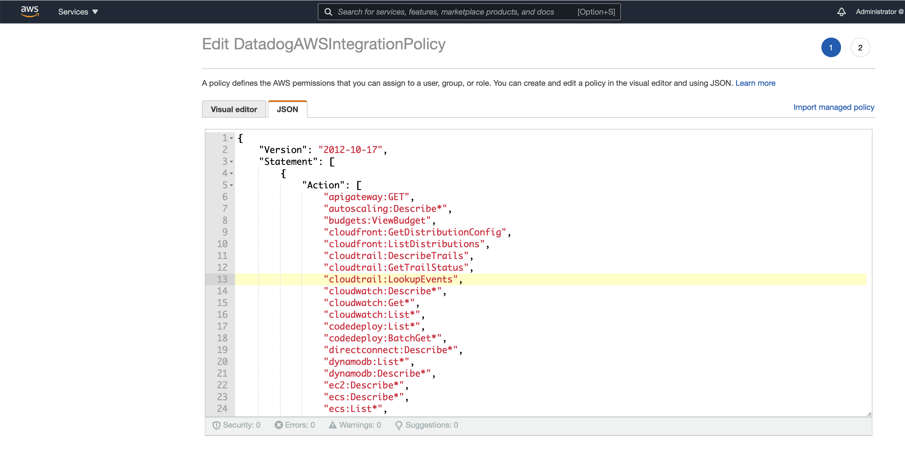
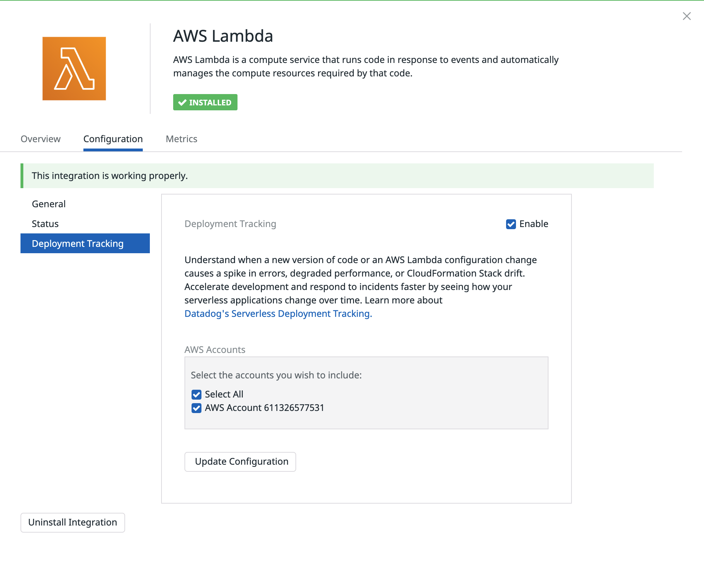
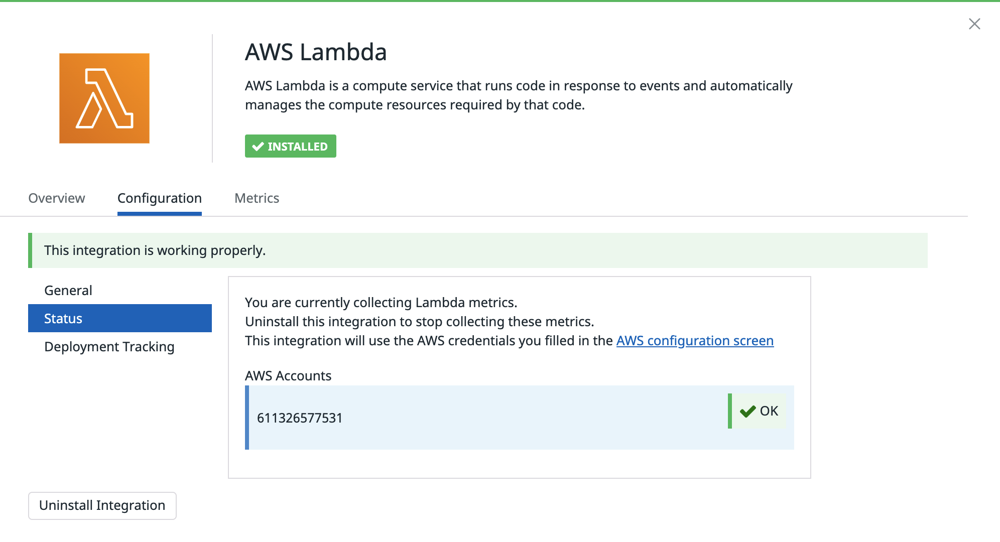
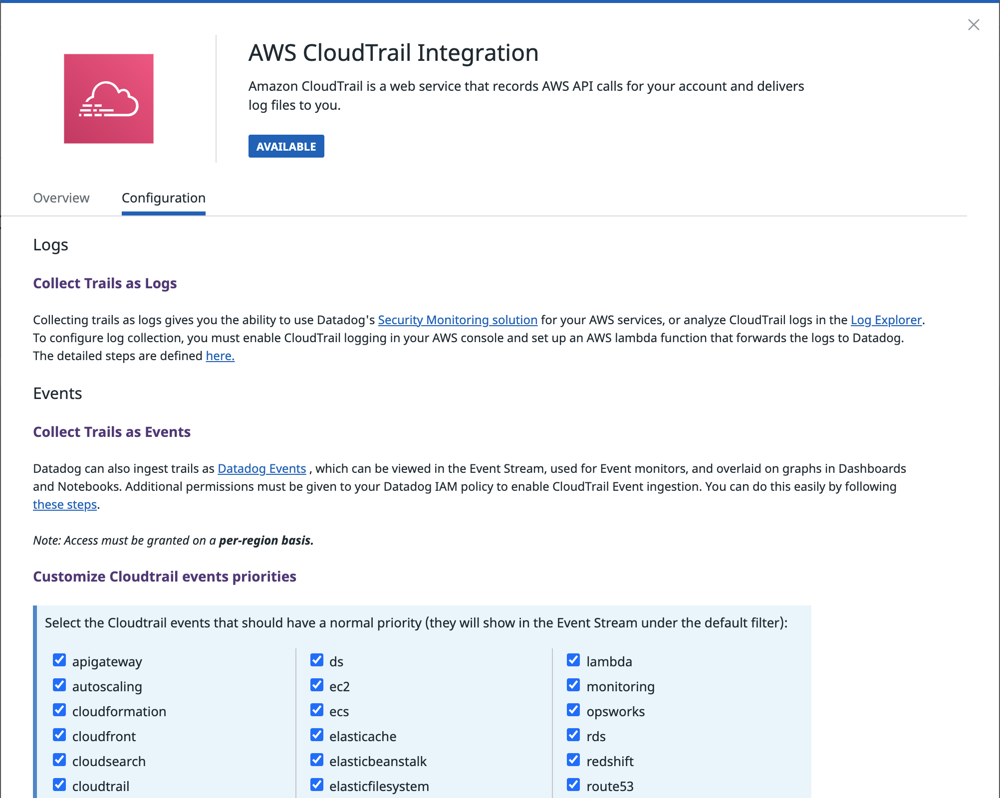
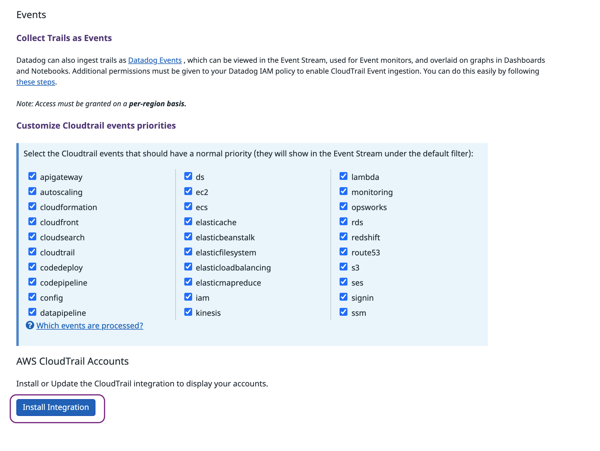
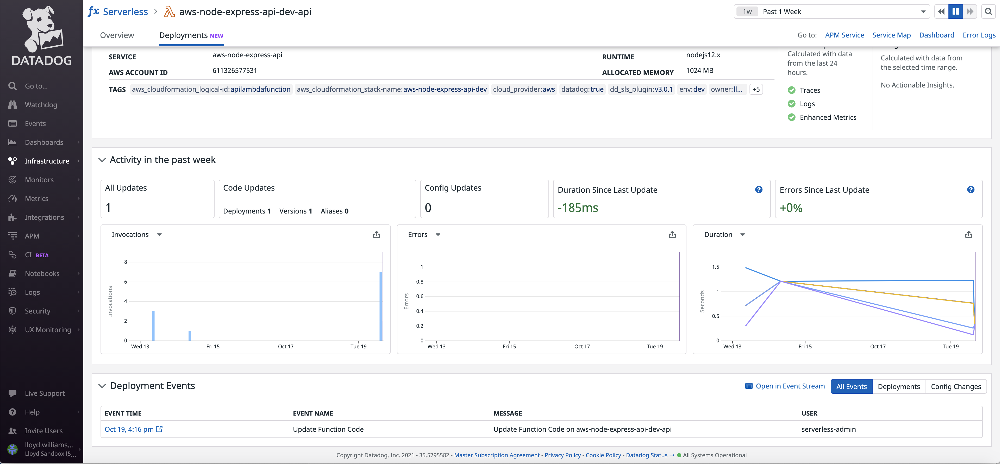
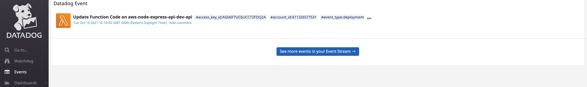
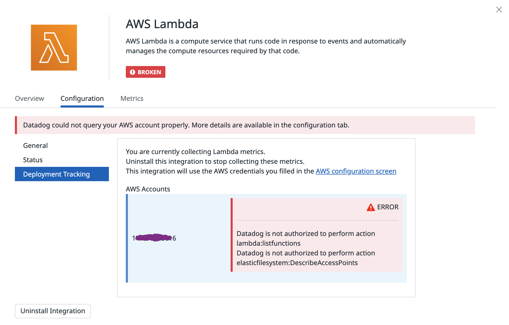

# AWS Serverless Deployment Tracking

How to configure (Datadog Docs): https://docs.datadoghq.com/serverless/deployment_tracking/

## [Setup](https://docs.datadoghq.com/serverless/deployment_tracking/#setup)

Datadog collects code and configuration change events for your AWS Lambda functions from AWS CloudTrail.

If you haven’t already, set up the [Amazon Web Services](https://docs.datadoghq.com/integrations/amazon_web_services/#setup) integration first. Then, add the following permission to the policy document for your AWS/Datadog role:

```text
cloudtrail:LookupEvents
```





The AWS Lamda tile within Datadog (https://app.datadoghq.com/account/settings#integrations/amazon-lambda) should be configured.



Make sure that the status of your AWS Lambda integration is OK.



Deployment tracking information is made available via AWS Cloudtrail which must be enabled from the Datadog Integration tile.

https://app.datadoghq.com/account/settings#integrations/amazon-cloudtrail







Click the "Install Integration" button to complete the set-up.



If you click in the Deployment Event Time, a new tab will open to show you the deployment in the Events list.



If you are experiencing issues, make sure that your AWS IAM Policy has all the appropriate permissions:

 