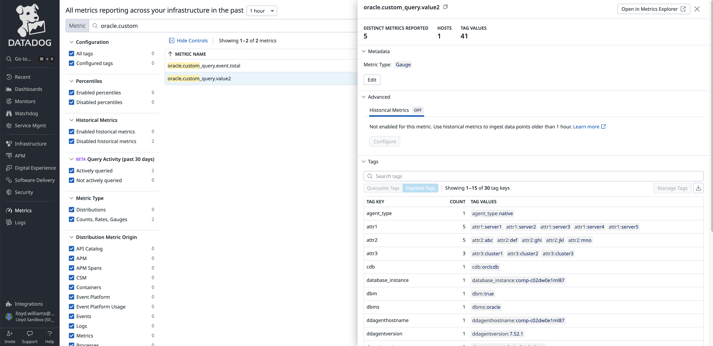
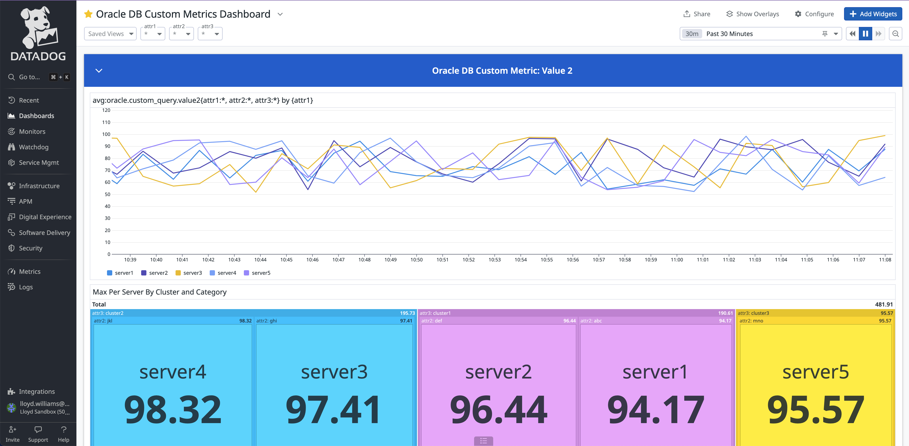

# Datadog Custom Metrics via DB Integration

## Oracle

This is an example of how to create custom metrics using the Datadog Oracle DB agent integration.

The pre-req for this is to configure the set-up of the database according to the [Datadog documentation](https://docs.datadoghq.com/database_monitoring/setup_oracle/selfhosted/?tab=multitenant). 

In order to do this you can supply a section in the oracle-dbm.d/conf.yaml file.

See [example file](conf.yaml)

```    custom_queries:
init_config:
  min_collection_interval: 5
instances:
  - server: 'localhost:1521'
    service_name: "ORCLCDB.localdomain" 
    username: 'c##datadog' 
    password: '<<YOUR_PASSWORD>>'
    reported_hostname: 'COMP-C02DW0E1ML87'  # Optional
    dbm: true
    tags:  # Optional
      - 'service:oracle12'
      - 'env:dev'
    custom_queries:
     - metric_prefix: oracle.custom_query
       query: SELECT 'foo', 88 FROM dual
       columns:
       - name: foo
         type: tag
       - name: event.total
         type: gauge
       tags:
       - test:lloyd
       pdb: ORCLPDB1
       query: SELECT attr1, attr2, attr3, value2 FROM LLOYD.METRICS
       columns:
       - name: attr1
         type: tag
       - name: attr2
         type: tag
       - name: attr3
         type: tag
       - name: value2
         type: gauge
       tags:
       - test:lloyd
       pdb: ORCLPDB1
```

In this example, the c##datadog user is performing the custom queries so you must provide access to the tables. 

e.g. **GRANT** **SELECT** **ON** LLOYD.METRICS **TO** c##datadog;

Within a couple of minutes you should start seeing your custom metrics in Datadog in the Metrics Summary section. Search starting with the metrics prefix that you provided (e.g. oracle.custom_query)



Then you can create your own custom dashboard using these metrics:




---

##### Troubleshooting:

You may also need to do:

**grant** restricted **session** **to** c##datadog; 
