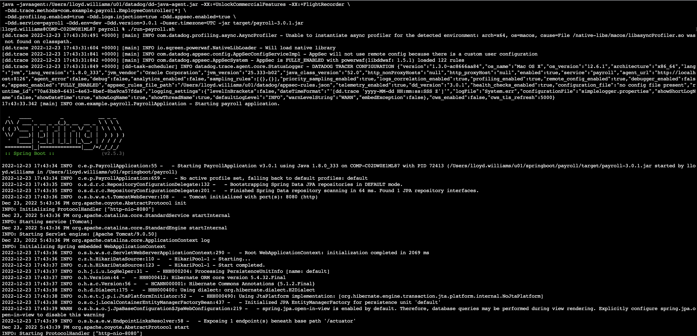
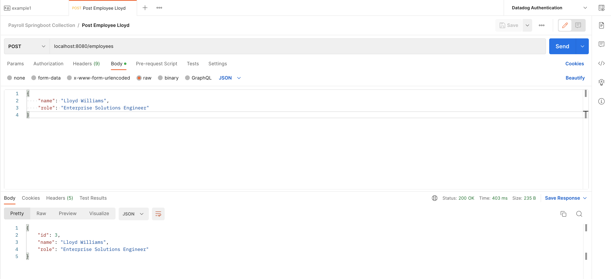
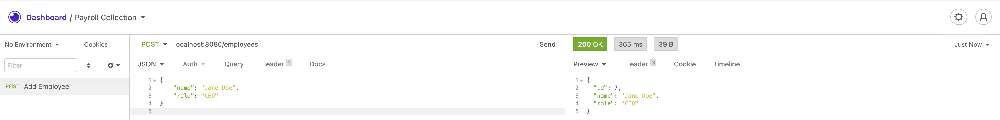
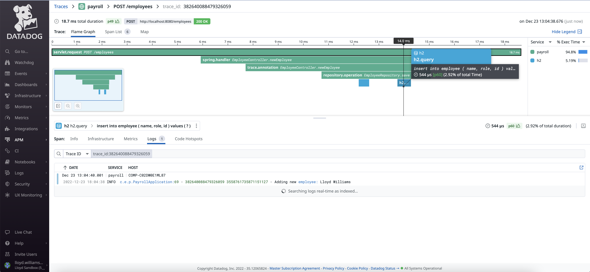
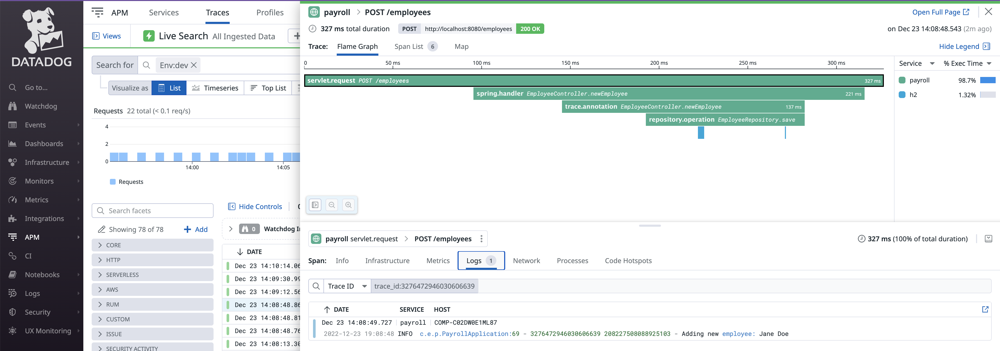

# Datadog for Java

[Oracle Java](https://www.oracle.com/java/) is the #1 programming language and development platform. 

## Java SDK

[Java SDK Downloads](https://www.oracle.com/java/technologies/downloads/) 

## Spring Boot

[Spring](https://spring.io/) is a framework by [VMWare Tanzu](https://tanzu.vmware.com/spring-app-framework).

The [Spring Boot](https://spring.io/projects/spring-boot) project makes it easy to create stand-alone, production-grade Spring based Applications that you can "just run".

The [Spring Initializr](https://start.spring.io/) can help you get started. 

This is an example of a [Spring Boot application](https://github.com/lloydwilliams/datadog/tree/main/kubernetes/payroll/eclipse-workspace/payroll) for Java 8. 

## Datadog APM

Any application packaged into a .jar file (such as a Spring Boot application) can be easily traced using the [Datadog tracing library available on GitHub](https://github.com/DataDog/dd-trace-java) by [adding the java tracer to the VM using -javaagent](https://docs.datadoghq.com/tracing/trace_collection/dd_libraries/java/?tab=springboot#add-the-java-tracer-to-the-jvm). 

You can easily get the latest version of the Datadog Java Trace library by running the command:

```
wget --no-check-certificate -O dd-java-agent.jar https://dtdg.co/latest-java-tracer
```

or check the version that you have using:

```
java -jar dd-java-agent.jar
```

You might want to put this in a [script](https://github.com/lloydwilliams/datadog/blob/main/java/get-new-dd-java-agent.sh) that you can run periodically to get the latest version because new features of the Java Trace Library are released on a regular basis. 

This tracing library sends the traces to the [Datadog agent](https://docs.datadoghq.com/agent/) installed on the host. So you must have that running also to accept the traces. 

For example:

```
java -javaagent:/u01/datadog/dd-java-agent.jar -XX:+UnlockCommercialFeatures -XX:+FlightRecorder \
 -Ddd.trace.methods=com.example.payroll.EmployeeController[*] \
 -Ddd.profiling.enabled=true -Ddd.logs.injection=true -Ddd.appsec.enabled=true \
 -Ddd.service=payroll -Ddd.env=dev -Ddd.version=3.0.1 -Duser.timezone=UTC -jar target/payroll-3.0.1.jar
```

There are many options that you can choose to set documented in the Datadog documenation for [Tracing Java Applications](https://docs.datadoghq.com/tracing/trace_collection/dd_libraries/java/?tab=springboot).



This application is a microservice which opens port 8080 to accept [REST](https://en.wikipedia.org/wiki/Representational_state_transfer) API calls.

You can run a [cURL command](https://blog.hubspot.com/website/curl-command) 

```
curl --location --request POST 'localhost:8080/employees' \
--header 'Content-Type: application/json' \
--data-raw '{
    "name": "Samwise Gamgee",
    "role": "gardener"
}'
```

or use a popular tool like [Postman](https://www.postman.com/downloads/) 




or [Insomnia](https://insomnia.rest/) to make the REST API call. 



Datadog APM will trace each call to the application and automatically generate spans for [certain types of activities](https://docs.datadoghq.com/tracing/trace_collection/compatibility/java/#networking-framework-compatibility) such as JDBC calls to a database. 

Notice that you can also configure the application to [inject the trace id into the logs](https://docs.datadoghq.com/tracing/other_telemetry/connect_logs_and_traces/java). This makes it very easy to see the logs related to this one specifc call without having to switch to a different tool. 





## Java J2EE / Jakarta EE

Java 2 Platform, Enterprise Edition [J2EE](https://www.oracle.com/java/technologies/appmodel.html) or [JakartaEE](https://jakarta.ee/) is a framework for running enterprise applications on top of an enterprise application server (e.g. WebLogic, WebSphere, JBoss, Apache Tomcat). These Java applications are usually packaged as either EAR files or just WAR files. 

[The JAR file is a file that has Java class files, related metadata, and resource combined into a single file to execute a Java application. The WAR file is a file that contains files such as a servlet, JSP, HTML, JavaScript, etc. that are necessary to develop web applications. EAR is a Java EE file that packages one or more modules into a single archive to deploy them on to an application server. That is the difference between JAR WAR and EAR files.](https://pediaa.com/what-is-the-difference-between-jar-war-and-ear/)

In this situation, when you want to instrument these Java applications that are packaged as a WAR file or EAR file, you want to instrument the underlying Java runtime, which is the application server itself by following the [Datadog instructions for that application server](https://docs.datadoghq.com/tracing/trace_collection/dd_libraries/java/?tab=tomcat#add-the-java-tracer-to-the-jvm). 


