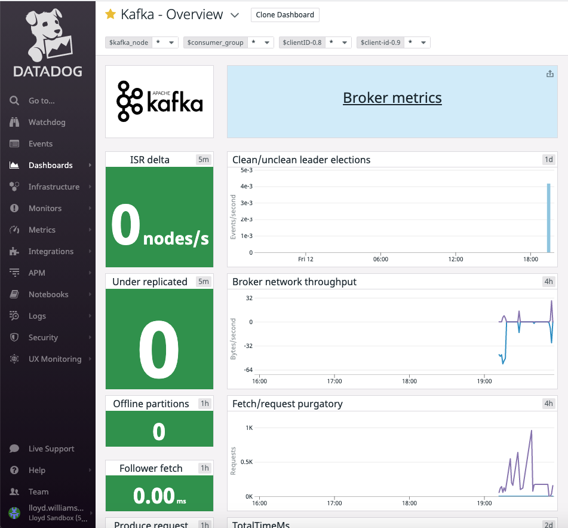
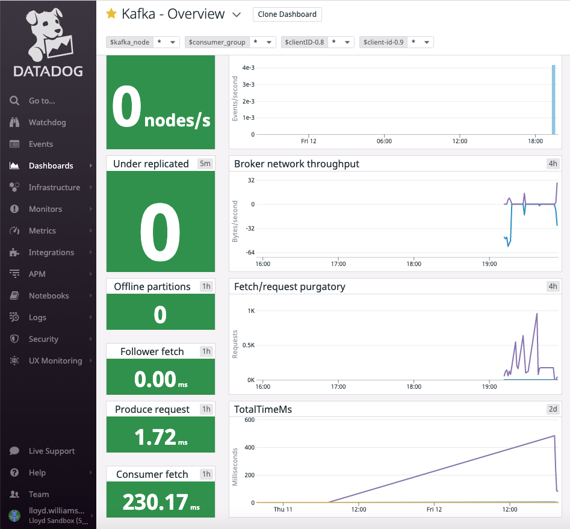

# Bitnami Kafka Monitored Using Datadog

This is a sample that illustrates setting up Bitnami Kafka to be monitored by Datadog.

Prerequisites: You must have Datadog configured and the agent deployed to collect metrics via JMX (see Tomcat sample).

After that, execute these scripts in numerical order to deploy Kafka with auto-discovery annotations to collect the Kafka broker's JMX metrics.

