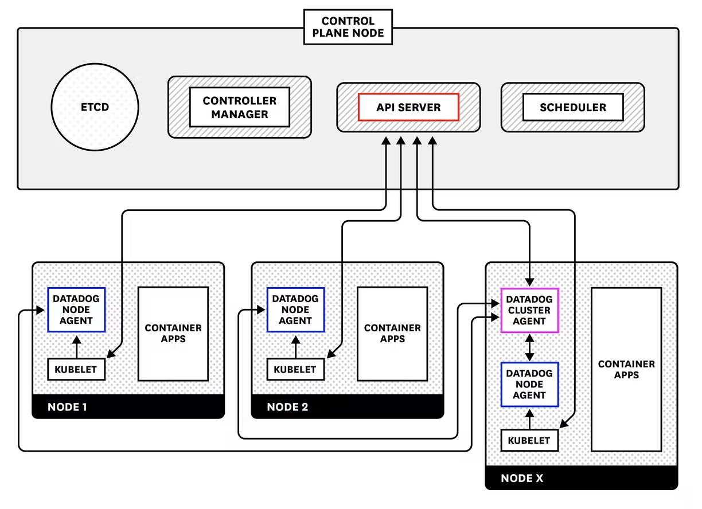

These scripts help you set-up the Datadog agent on Kubernetes (K8S) and configure the Datadog cluster agent for APM with Java Springboot.

For more information, please refer to:

K8S

https://docs.datadoghq.com/agent/kubernetes/

https://docs.datadoghq.com/agent/kubernetes/installation/?tab=helm

https://github.com/DataDog/helm-charts

https://github.com/yafernandes/datadog-experience/blob/main/deployment/kubernetes/aks.md

https://www.datadoghq.com/blog/monitoring-kubernetes-with-datadog/#the-datadog-cluster-agent

YAML

https://jsonformatter.org/yaml-formatter

