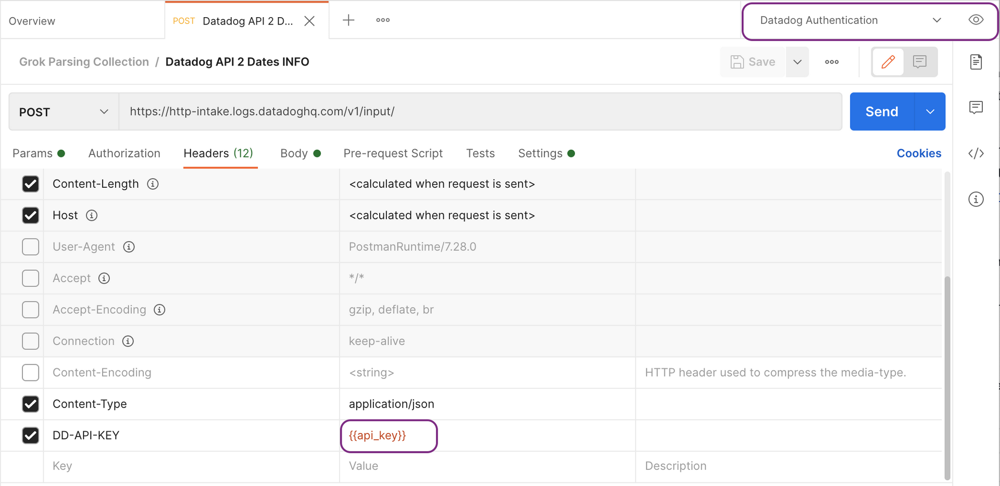
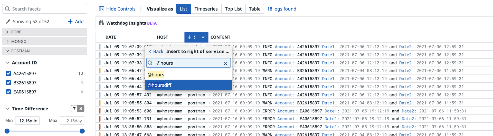
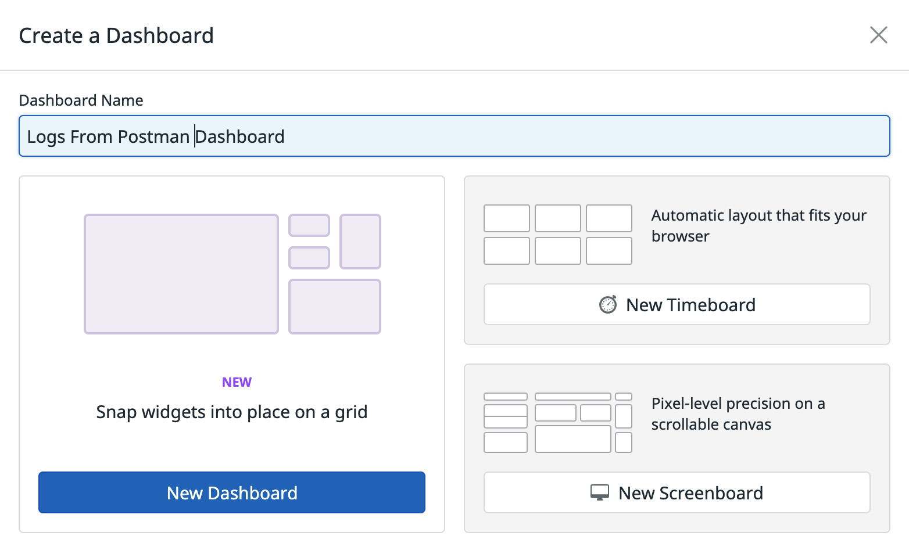

# Log Processing


## Sending Logs Via Datadog API (HTTP) 

https://docs.datadoghq.com/getting_started/api/

### Datadog Postman Collection

If you'd like to work with a 3rd party tool for making REST API calls to Datadog, Datadog has created a Postman collection that can be imported which has samples of all the API calls that can be made. 

If you'd prefer not to set-up Postman, you can use the curl scripts provided [here](https://github.com/lloydwilliams/datadog/tree/main/logs/time-difference/curl). You can then start at the [Log Pipelines](https://github.com/lloydwilliams/datadog/tree/main/logs/time-difference/tutorial#log-pipelines) section below.

You can click the "Run in Postman" button in the set-up section of the docs and it will import the Datadog collection into your Postman account. 
https://docs.datadoghq.com/getting_started/api/#setup


### Sample Collection

This sample collection available [here](https://github.com/lloydwilliams/datadog/blob/main/logs/time-difference/postman/Grok%20Parsing%20Collection.postman_collection.json) is for this tutorial and can be used to send sample logs to Datadog via API. You will need to import it into your Postman (either the desktop version or in the browser version).


https://github.com/lloydwilliams/datadog/blob/main/logs/time-difference/postman/Grok%20Parsing%20Collection.postman_collection.json

*This is for demo purposes only and is not actively maintained by Datadog, so it may become out-of-date in the future.* 

These requests use an API Key variable called `api_key`in the HTTP Headers section, so you will need to either set a postman environment variable to the value of your own Datadog API Key or remove the variable and put your own Datadog API Key in its place. For more information on how to do this please refer to the [Postman documentation](https://learning.postman.com/docs/sending-requests/variables/). 





This will allow you to send logs to Datadog via the API. 

The next section will show you how to process the logs so they can look like the image below when they are in Datadog with the 'Account ID' extracted and used as a 'Facet' and the time difference between the dates calculated and set-up as a 'Measure' so that users can filter and sort by these values. 


## Log Pipelines

The next step is to create a log pipeline for processing the logs.


In Datadog, click on Logs, Configuration from the side bar menu or use the direct link: [https://app.datadoghq.com/logs/pipelines](https://app.datadoghq.com/logs/pipelines)

Choose 'Add a new pipeline':


The source in this example is defined as "postman", so use a filter that "source:postman" as the pipeline for these logs. Also, give the pipeline a name (e.g. Postman Logs). You can even try sending some logs via API to make sure that the logs are going to this pipeline. 


If you need to return to this window after the configuration is saved, you may need to click on the 'edit' option to open the box again. 


### Grok Parser

Underneath this pipeline, choose 'Add Processor'. 


Click the "Parse My Logs" button. *Note: you may need to make sure that you have sent logs recently or attempt to currently send some more logs.* 

You should see that it found some recent logs and auto-generated some parsing rules:


In this case, you really only need 1 rule, so you can delete the extra log samples and extra rules and use one rule that is slightly modified from the auto-generated rule that looks like this:

```
myRule1 %{date("yyyy-MM-dd HH:mm:ss"):date}\s+%{word:level}\s+Account:\s+%{word:account}\s+Date1:\s+%{date("yyyy-MM-dd HH:mm:ss"):startdate}\s+and\s+Date2:\s+%{date("yyyy-MM-dd HH:mm:ss"):enddate}
```

You will know that it's correct when you see the green check mark which indicates that it matched a rule.
You will also see how it's going to parse the data. 


In this case, we want to convert the date to a number of milliseconds, so that we can later easily calculate the duration. 

When the parsing logic is what you want, you can give the Grok Parser a name and 'Save' it.


### Arithmetic Processor

Next we need an 'Arithmetic Processor' to subtract the end date from the start date and to put it in a more user-friendly unit of time. 

You simply add a "Add Processor" again to the same pipeline, but this time choose 'Arithmetic Processor'.


Set a target attribute (e.g. datediff) and set the formula to: enddate - startdate (or whatever names you defined in your Grok parser above for the dates). 


Save the Arithmetic Processor. 

Next create another Arithmetic Processor. 
(Of course, you could have done this with 1 Arithmetic Processor, but doing it with 2 may give you some design flexibility in the future.)

Use it to divide the number calculated above (datediff) by 3600000 and assign the target attribute a name like "hoursdiff".


Save the second Arithmetic Processor.

### Test the Pipeline Processors

Send some more logs via the Datadog API.
Go to the Logs, Search section and click on one of the logs entries. You should see the 'Event Attributes' that you created.


## Facets and Measures 


### Facets

Hover just to the left of the 'account' attribute and click on the gear icon. 


Choose the "Create facet for @account" option.

Set the display name (e.g. Account ID), Type as 'String', provide a Group (e.g. Postman) and a Description.


### Measures

Hover just to the left of the 'hoursdiff' event attribute. Since this is a number, select 'Create measure for @hoursdiff'


Set the display name to "Time Difference". Use this name instead of hours difference because Datadog will automatically create an appropriate string to display based on the amount of time. 

Set the Type to Double. 

Set the Unit to Hour (hr), this tells Datadog that the value that we calculated for this measure was in hours. 

Set the Group to the same group name that you used for the 'Account' Facet above. This will keep these two grouped together in the side Facets section since they are related to the same logs (and it will allow them to both be easily collapsed at the same time when they are not needed). 

Also, supply a Description. 

Save the new Measure. 

Reload the Logs screen in the browser, so it can pick up the new facet and measures in Facets section.


#### Try out the Facets and Measures

Type in the Search Bar (where it says: Filter your logs) `Host:myhostname` you should get only the logs for this hostname.

Open the facet 'Acccount ID' and select which account you are interested in. Notice that it also populates the search bar and will then filter the logs. 


Likewise try out the 'Time Difference' facet. You'll notice that instead of check boxes, there are sliders to adjust min and max values.

Click on the header for the 'Service' column and select 'Insert to right'.


Start typing '@hoursdiff', you can select it when it appears. 




Notice that the 'Time Difference' column appears and there is a value for each log.


Click the Column Header and try sorting by 'Time Difference' values. 


*Note: you can't do this when you are in 'Live Tail' mode, you must have a fixed time period selected.*


# Viewing Logs in Custom Dashboards

## New Dashboard

From the Dashboards menu, select New Dashboard.

Set the Dashboard Name and click on the 'New Dashboard' button. 




Click the '+ Add Widgets' button:

Use the arrow on the right to find the 'Log Stream' widget. 


Drag it onto the canvas.


A configuration panel appears.

Set the number of display lines or if you don't want any, toggle the 'Content Column' option. 


Add the columns @account and @hoursdiff and give the graph a title. 
*Note: this won't be an option for you if you did not define the facet and measure in the previous section.*


Click Done and then make the widget wider (if you'd like) by dragging from the bottom right corner. 


Note that you can click on any log entry and it will take you back to the Log Search section where you can see all the event attributes and other details. You could potentially pivot to the APM traces a log entry if these logs were generated by an application that has APM tracing enabled and is also writing logs to Datadog via the agent.


## Dashboard Template Variables

Click on 'Add Template Varables' below the dashboard title.


After that click on the 'Add Variable' button and create a variable called "host_var" and assign it the Tag or Attribute = 'host' and the Default Value 'myhostname'.


Modify the Log Stream editor configuration to have '$host_var' in the 'Search Query' and click Done.


You should only see logs from the default hostname.


Next start to add another variable for the account id by clicking the pencil at the end of the variables.


Use the 'Add Variable' button to add the`account_var` variable name and set the 'Tag or Attribute' to `@account`.


Click Done.

Next add `$account_var` to the 'Search Query' of the Log Steam Editor widget, like you did with the `$host_var`.


Click Done and click on the 'account_var' drop-down menu. 


Select a specific Account Id from the list of 'Associate Values'. Notice that it filtered the logs. You can also use this in combination with the time frame in the top right section. 

Note: if the account ID that you want does not show in the list of associated values, it is still possible to cut and paste it into the box.


### Create a Query Widget

Click on the Add Widgets button.


Drag the Query Value widget to the canvas.


A configuration panel will appear. 

In the Graph your data section, Choose "Logs" from the drop-down list for metric 'a'. 

Add the variables `$host_var` and `$account_var` in the search box for metric 'a' (with a space between the variable names).

Configure the Units and formatting, so that it shows 0 decimals and none of the boxes are checked.

Experiment with some conditional formatting. For example, if the value is greater than 10 you can show with a Red background, greater than 5 with a Yellow background and less than 5 with a Green background.   

## 

Save the configuration and click on the Close button at the top to close the editing session. 

Try sending some more logs using the API calls and see what happens when you change the values of the variables and the timeframe. 


## Create a Favorite Dashboard

If you like what you've done, click the star icon next to the name of the Dashboard to make it one your favorites. 


