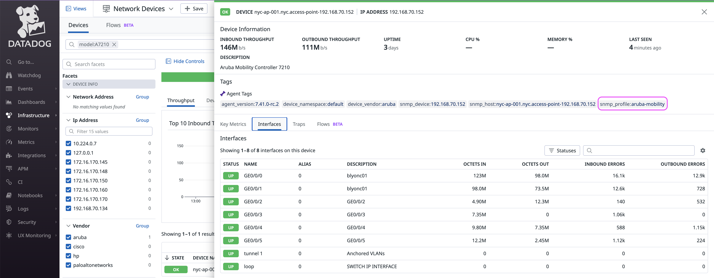
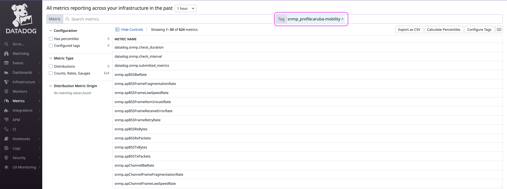
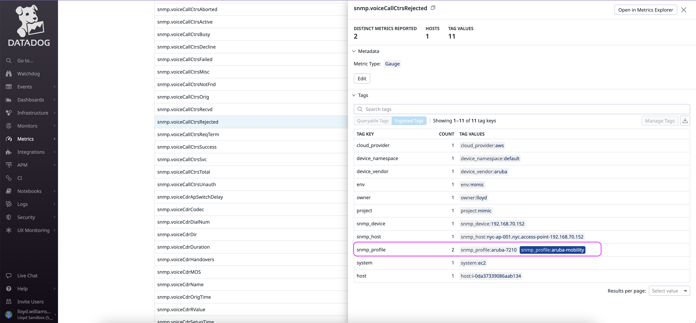
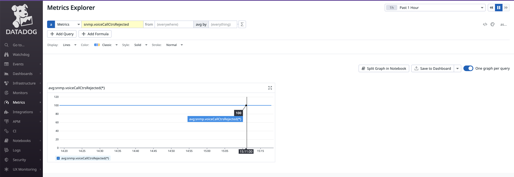

# NDM Custom Profiles

Datadog Network Device Monitoring (NDM) allows you to create custom SNMP profiles in order to collect additional metrics from your devices.

You will need to specify the metrics in the format used by the Datadog agent. Datadog has a utility to do this. Refer to the [Datadog documentation](https://docs.datadoghq.com/network_monitoring/devices/guide/build-ndm-profile/#add-a-profile) on how to do this and the SNMP section of the [Datadog website for Developers](https://datadoghq.dev/integrations-core/tutorials/snmp/profiles/#generate-a-profile-file-from-a-collection-of-mibs). 

It requires that all of the custom MIBs (in ASN1 format) including dependencies be in a single folder. There are some publicly available sources to retrieve some of the dependencies (e.g. https://www.circitor.fr/Mibs/Mibs.php or from Datadog's fork of an SNMP Labs repository https://github.com/DataDog/mibs.snmplabs.com). The SNMP Labs repository may be unavailable.

An example of a custom profile for Aruba switch devices (`aruba-mobility.yaml`) is in the folder `profiles`. This is a file you can add to the agent's SNMP profiles folder `/etc/datadog-agent/conf.d/snmp.d/profiles` on Linux.  

The custom MIBs need to be converted into python format as the example ones shown in the folder `custom_pysnmp_mibs`.

You will need to then put these in a folder that is accessble to the Datadog agent that will be running the SNMP integration (e.g. `/opt/datadog-agent/custom_pysnmp_mibs`. 

### Summary steps to implement this example for an Aruba Mobility Controller: 

1. Create a folder on the server running the Datadog agent (e.g. `/opt/datadog-agent/custom_pysnmp_mibs/aruba-mobility`) and copy the files from the `custom_pysnmp_mibs` folder to that folder. (You can download the zip file [aruba-mobility.zip](https://github.com/lloydwilliams/datadog/blob/main/ndm/custom-profiles/custom_pysnmp_mibs/aruba-mobility.zip) and unzip it on your machine)

2. Add the profile `aruba-mobility.yaml` to the SNMP config profiles folder (e.g. `/etc/datadog-agent/conf.d/snmp.d/profiles`). This contains all of the possible metrics in the metrics section. **You may want to carefully remove any metrics from this file that you do not want to collect. Otherwise, you will be periodically polling the device for all of these metrics.** 

3. Modify the `snmp.d/conf.yaml` file or copy the example `conf-aruba-mobility.yaml` (you can use more than 1 conf.yaml file in the snmp.d folder) into the SNMP configuration folder. Make any changes necessary. For example, you will need to modify the device IP address, community string and possibly the port number. 

4. Restart the Datadog agent.

   

#### To check to see if it is working, from the command line you can run the command to check the snmp check:

Linux: sudo -u dd-agent datadog-agent check snmp

Windows: "C:\ProgramFiles\Datadog\Datadog Agent\bin\agent.exe" check snmp

Also, you can go to the Datadog UI and check your device to see what profile it uses:

After a few moments, you should start seeing new metrics appear in Datadog with the prefix `snmp.`

Then use the Metrics Explorer to see the values for that metric and use this metric to create monitors and dashboards. 

