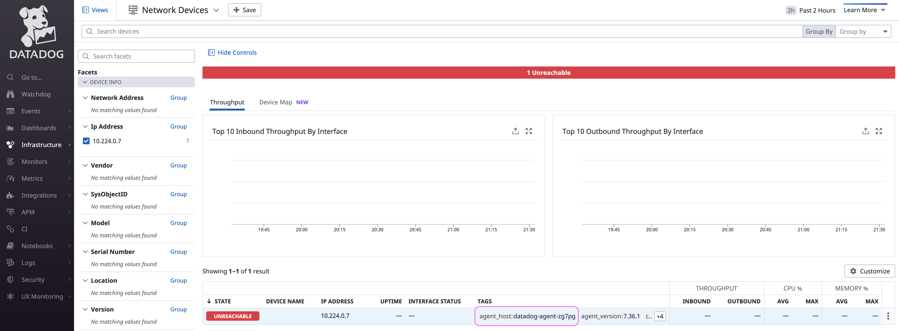

These scripts help you set-up the Datadog agent on Kubernetes (K8S) and configure the Datadog cluster agent for Network Device Monitoring (NDM) using SNMP.


For more information, please refer to:

https://www.datadoghq.com/blog/monitoring-kubernetes-with-datadog/#the-datadog-cluster-agent

K8S

https://docs.datadoghq.com/agent/kubernetes/

https://docs.datadoghq.com/agent/kubernetes/installation/?tab=helm

https://github.com/DataDog/helm-charts

https://github.com/yafernandes/datadog-experience/blob/main/deployment/kubernetes/aks.md

NDM

https://docs.datadoghq.com/network_monitoring/devices/guide/cluster-agent/

https://docs.datadoghq.com/network_monitoring/devices/setup/?tab=snmpv2

YAML

https://jsonformatter.org/yaml-formatter


The SNMP integration will run from one of the nodes in the K8S cluster. If that node fails, the configuration will move to another node.



```
kubectl exec datadog-agent-cluster-agent-c69d658b6-s4qgv -- agent clusterchecks
```

