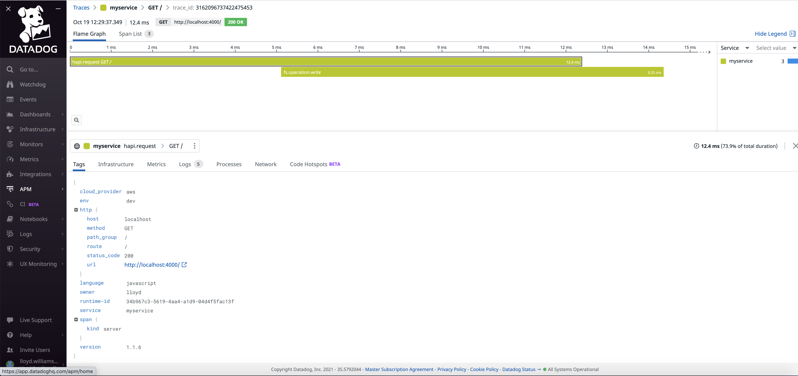
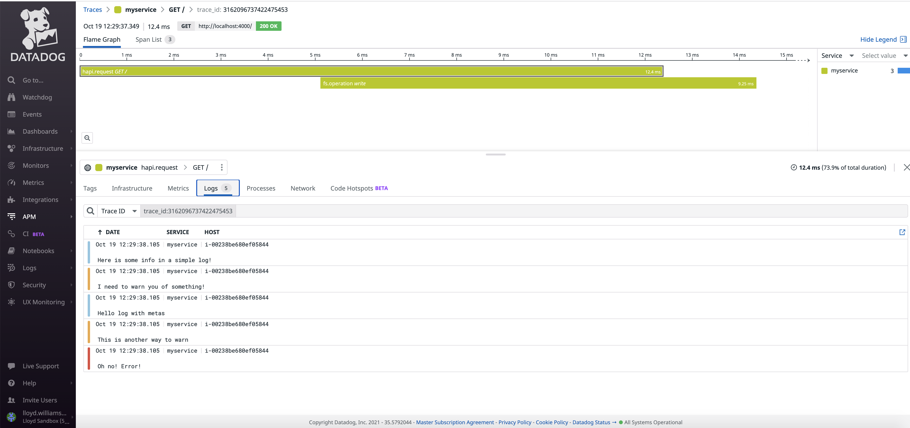
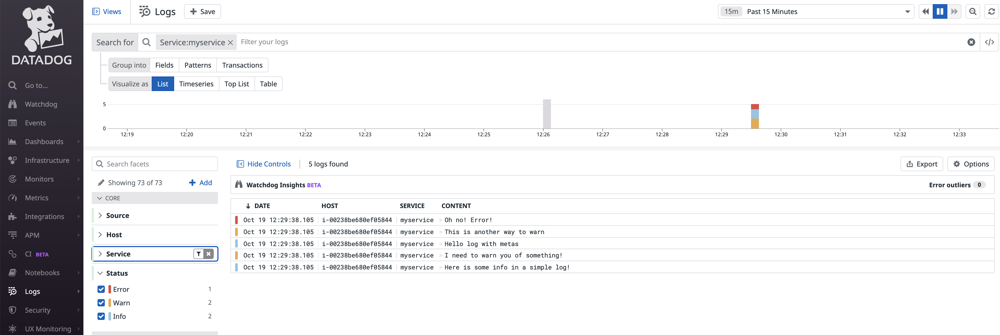
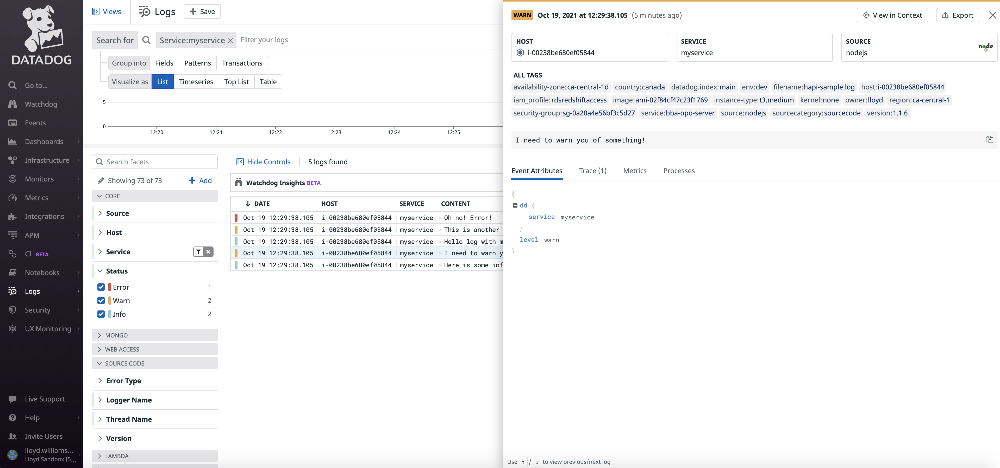
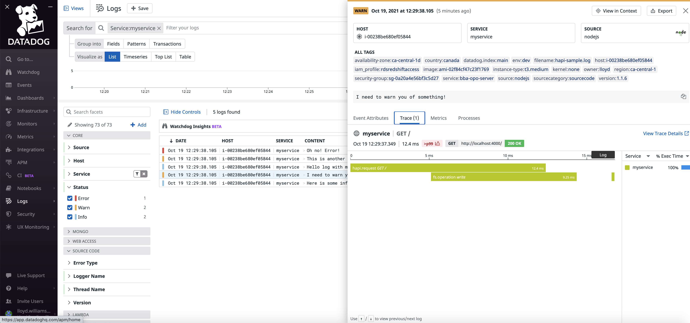
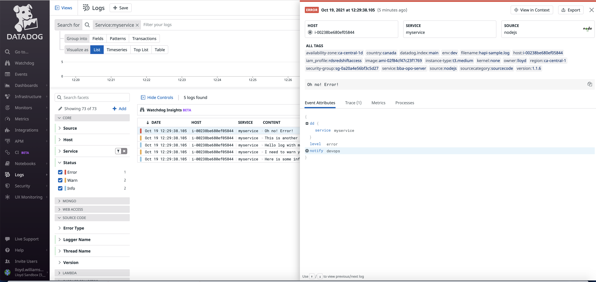
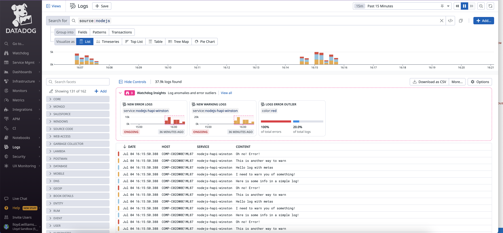
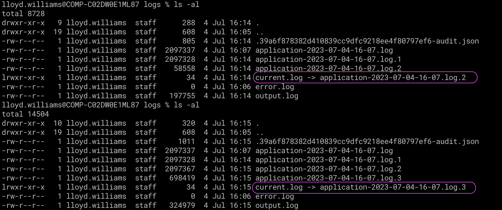

# Datadog NodeJS Sample with Hapi and Winston


This sample shows how to integrate Datadog with a microservice running using the Hapi web framework (https://hapi.dev/) for HTTP https://docs.datadoghq.com/tracing/setup_overview/compatibility_requirements/nodejs/#web-framework-compatibility and Winston (https://github.com/winstonjs/winston) for logs https://docs.datadoghq.com/tracing/setup_overview/compatibility_requirements/nodejs/#logger-compatibility.

This will enable you to trace your requests using Datadog APM. https://docs.datadoghq.com/tracing/

https://docs.datadoghq.com/tracing/setup_overview/setup/nodejs/?tab=otherenvironments



It will also show you how to correlate your logs with the traces by injecting the trace id into the logs.

https://docs.datadoghq.com/tracing/connect_logs_and_traces/nodejs/



You can create logs with different statuses that will appear color-coded within Datadog.



You can filter by the status and click on the log to bring up more details. 



Notice how the logs also correlate back to the APM traces. 



and you will also see how to create logs which contain additional information in the event attributes. 



You can create facets from any of the event attributes to allow you to analyze the logs any way you want. 


### Updated with Log file rotation:

https://github.com/winstonjs/winston-daily-rotate-file

```

const transport1 = new transports.DailyRotateFile({
  level: 'info',
  filename: `${logDir}/application-%DATE%.log`,
  datePattern: 'YYYY-MM-DD-HH-MM',
  zippedArchive: false,
  maxFiles: '4d',
  maxSize: '2m',
  createSymlink: true,
  symlinkName: 'current.log'
});

const logger = createLogger({
  level: 'info',
  format: format.combine(
    format.timestamp({
      format: 'YYYY-MM-DD HH:mm:ss'
    }),
    format.json()
  ),
  transports: [
    transport1
  ]
});
```






Configure Datadog to use the `current.log` file (e.g. /etc/conf.d/nodejs.d/conf.yaml)

```
init_config:

logs:

  - type: file
    path: "/Users/lloyd.williams/u01/nodejs/hapi-winston/myproject/logs/current.log"
    service: nodejs-hapi-winston
    source: nodejs
```


