# Getting Started with Datadog Observabilty Pipelines

This is a sample to get you started with using Datadog Observability Pipelines.

Here is where you will find the official [Observability Pipelines documentation](https://docs.datadoghq.com/observability_pipelines/).

## Development

For development environments, you can follow the instructions for [downloading](https://vector.dev/download/) setting up [Vector](https://vector.dev/). You may also find it more convenient to use the [package manager](https://vector.dev/docs/setup/installation/package-managers/) for your operating system. 

If you are working on a Debian-based Linux operating system, you should proceed directly to the instructions for [Installing Observability Pipelines on Linux](https://docs.datadoghq.com/observability_pipelines/installation/?tab=linux).

## Vector Remap Language (VRL)

Vector Remap Language (VRL) is an expression-oriented, domain specific language designed for transforming observability data (logs and metrics). It features a simple syntax and [built-in functions](https://vector.dev/docs/reference/vrl/functions/) tailored to observability use cases.

Vector Remap Language is supported in the `remap` transform.

You can test your logic VRL logic using a command line interface which is accessible from the command:

```
vector vrl
```

or use this [bash script](./vrl/start-vrl-repl.sh).

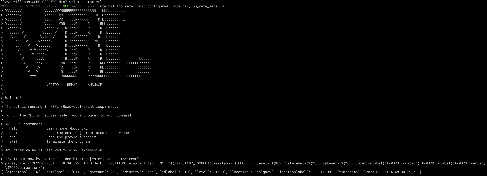

You can try it out for yourself using this sample VRL logic:

```
parse_grok!("2023-03-06T14:48:34.592Z INFO GATE:5 LOCATION:calgary ID:abc IN", "%{TIMESTAMP_ISO8601:timestamp} %{LOGLEVEL:level} %{WORD:gatelabel}:%{WORD:gatenum} %{WORD:locationlabel}:%{WORD:location} %{WORD:idlabel}:%{WORD:identity} %{WORD:direction}")
```

You'll see that it used Grok to parse the log message and output JSON.

```
{ "direction": "IN", "gatelabel": "GATE", "gatenum": "5", "identity": "abc", "idlabel": "ID", "level": "INFO", "location": "calgary", "locationlabel": "LOCATION", "timestamp": "2023-03-06T14:48:34.592Z" }
```

## Datadog Observability Pipelines Configuration Keys

In you Datadog account, go Observability Pipelines under Logs: 

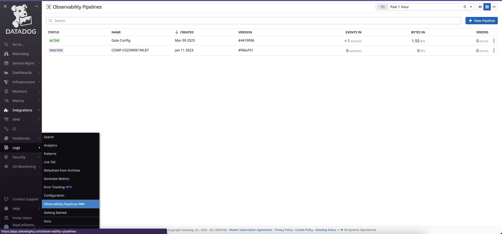

Click on the New Pipeline button and set the name of your pipeline. If you click on the Get Started button or switch to the Pipeline view, you can start building a new pipeline in the Datadog UI.

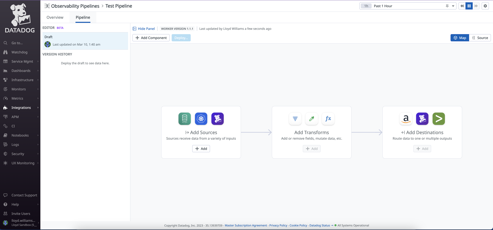

Try building a valid pipeline by connecting the demo logs to Datadog.  

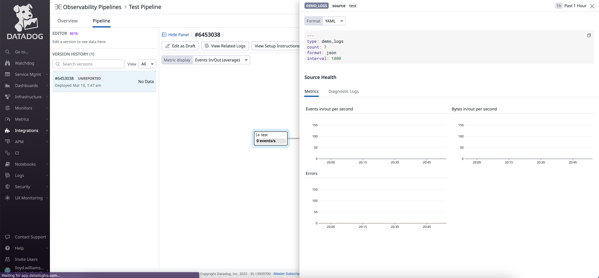

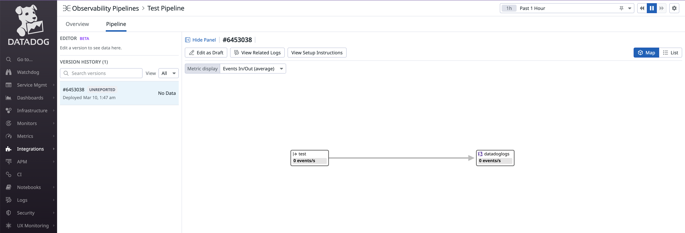

Click on "View Setup Instructions".

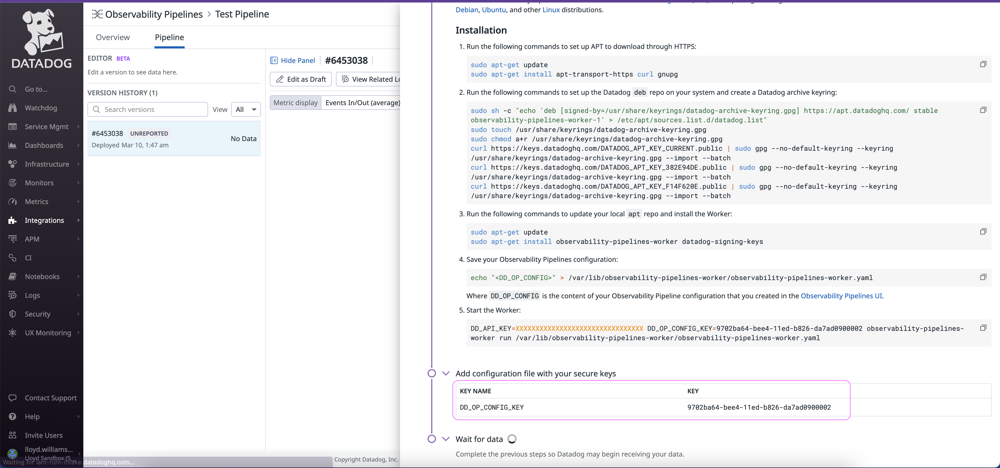

If you are installing on a Debian-based linux, you can follow the instructions. 

*** IMPORTANT *** Make a note of the `DD_OP_CONFIG_KEY`, you wil need it in the next step.

## Log Reduce Example - Gates App

This sample shows how to collapse two log lines into one. It uses [reduce](https://docs.datadoghq.com/observability_pipelines/reference/transforms/#reduce) to collapse an “IN” log and an “OUT” log into a single log.

1. You can run the application using the script [run-gates-app.sh](./examples/gates-app/run-gates-app.sh)
2. You can test it by running the script [test-gates-app.sh](./examples/gates-app/test-gates-app.sh) or by importing [this Postman collection](./examples/gates-app/Gate Collection.postman_collection.json) into [Postman](https://www.postman.com/) and sending your own payloads. 
3. This application will generate a log file called: [gate-activity.log](./examples/gates-app/logs/gate-activity.log) that will read by the observability pipeline. 
4. Set your Datadog API key as the environment varible called `DD_API_KEY` and the Datadog Observability Pipelines Key as the environment variable `DD_OP_CONFIG_KEY` or modify the [start-observability-pipelines-worker.sh](./examples/gates-app/start-observability-pipelines-worker.sh) file and replace `${DD_API_KEY}` with your Datadog API key and `${DD_OP_CONFIG_KEY}` with the Datadog Observability Pipelines Config key.
5. Start the Observabilty Pipeline using the [start-observability-pipelines-worker.sh](./examples/gates-app/start-observability-pipelines-worker.sh) script which will run this [observabilty pipelines-worker](./examples/gates-app/observability-pipelines-worker.yaml).

NOTE: remove this part of the pipeline if you used the instructions for [Installing Observability Pipelines on Linux](https://docs.datadoghq.com/observability_pipelines/installation/?tab=linux).

```
enterprise:
  api_key: "${DD_API_KEY}"
  configuration_key: "${DD_OP_CONFIG_KEY}"
  site: "datadoghq.com"
```


##### Gates Application

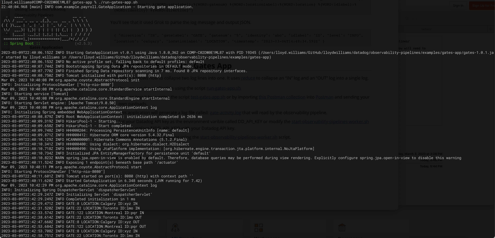

##### Testing

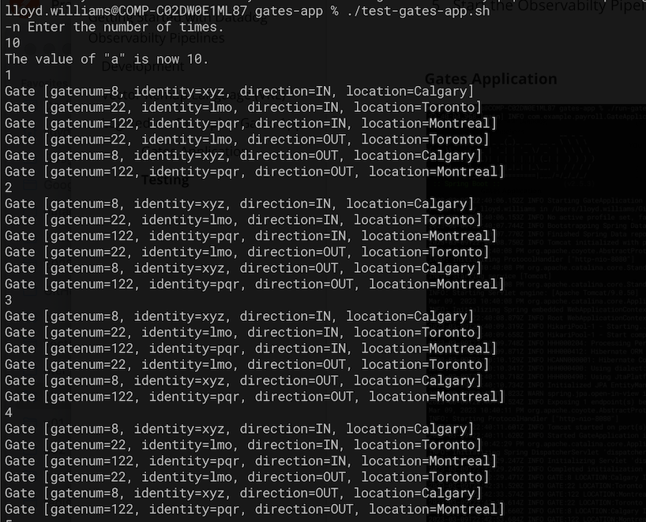

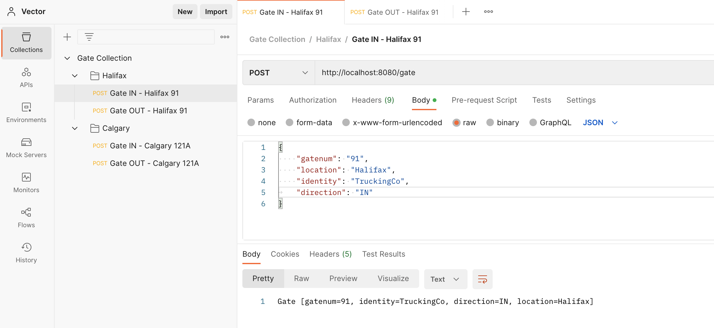

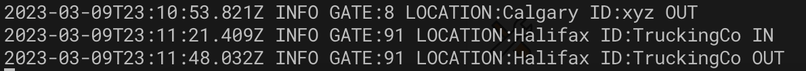

##### Observability Pipelines Worker

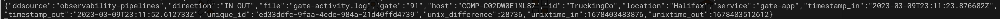

##### Datadog Logs

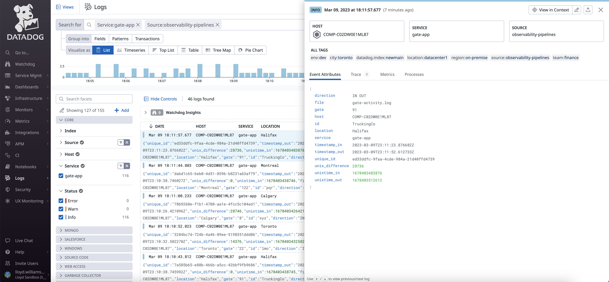

##### Datadog Observability Pipeline Worker

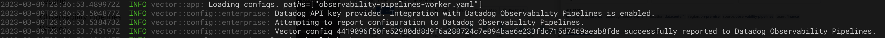

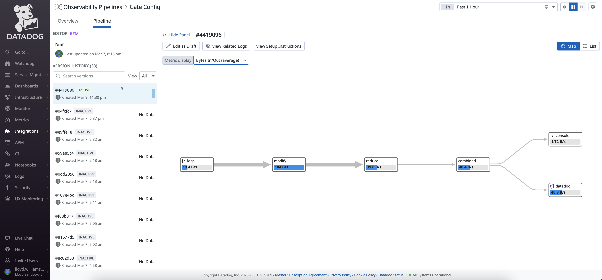

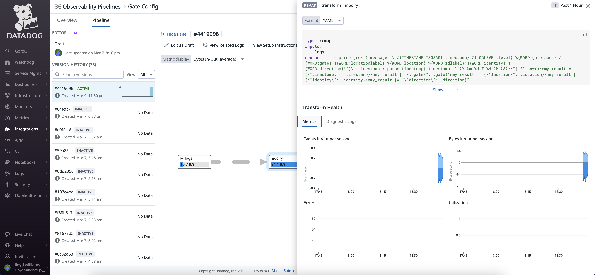

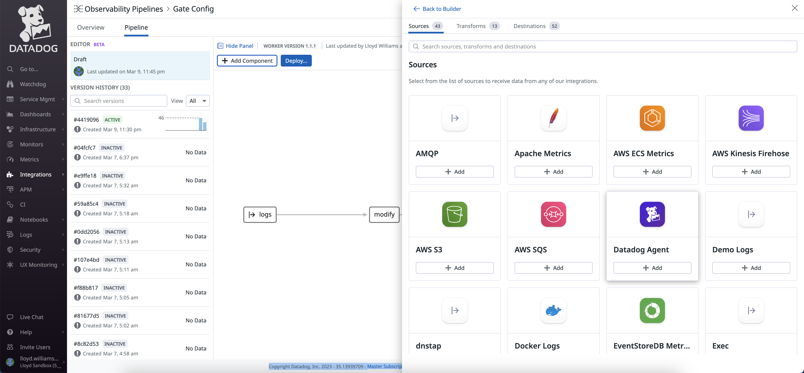

## Datadog Custom Metrics From Logs

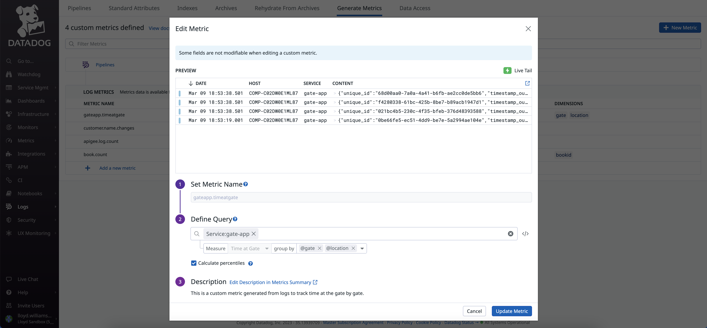

## Datadog Facets and Measures

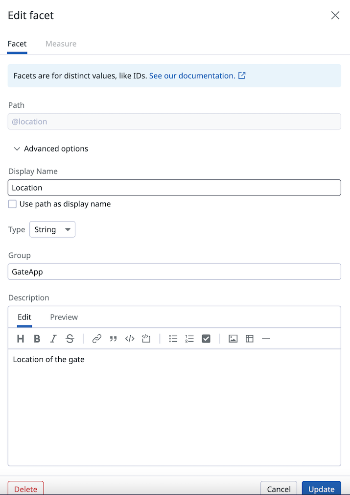


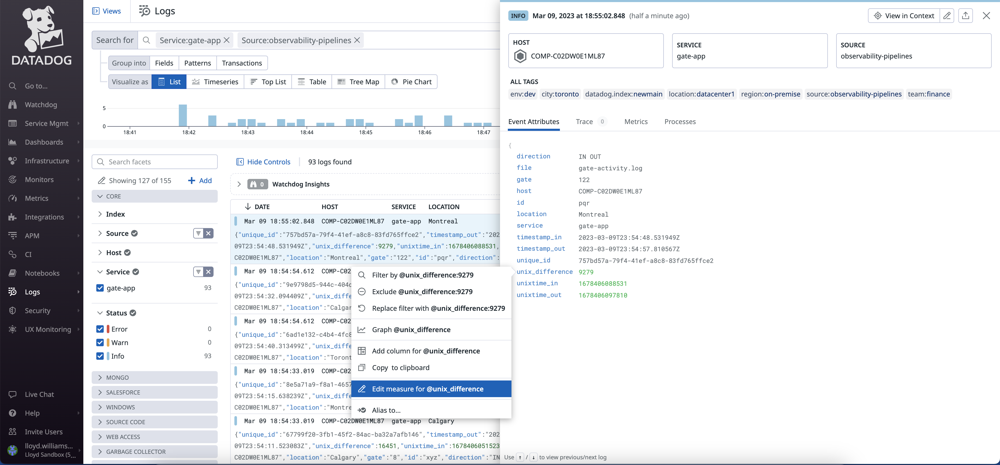

## Datadog Log Analytics

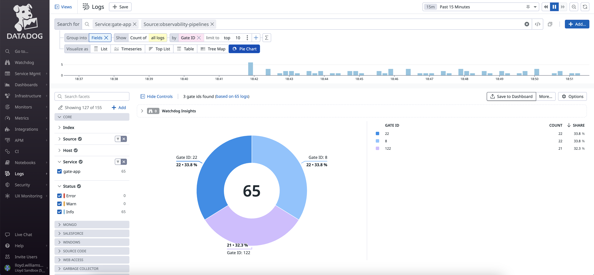

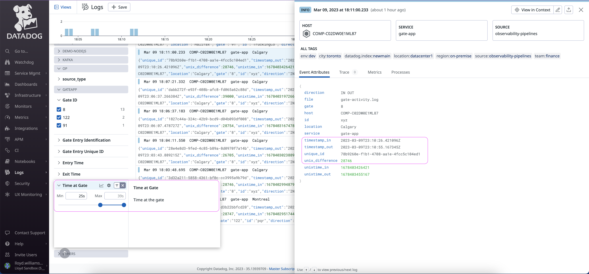

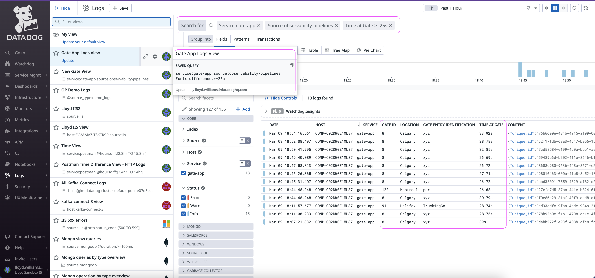

## Datadog Dashboards


This [dashboard](./examples/gates-app/GateDashboard.json) can be imported into your Datadog environment. 

You can also track the version history and monitor the performance of your Datadog Observability Pipeline.

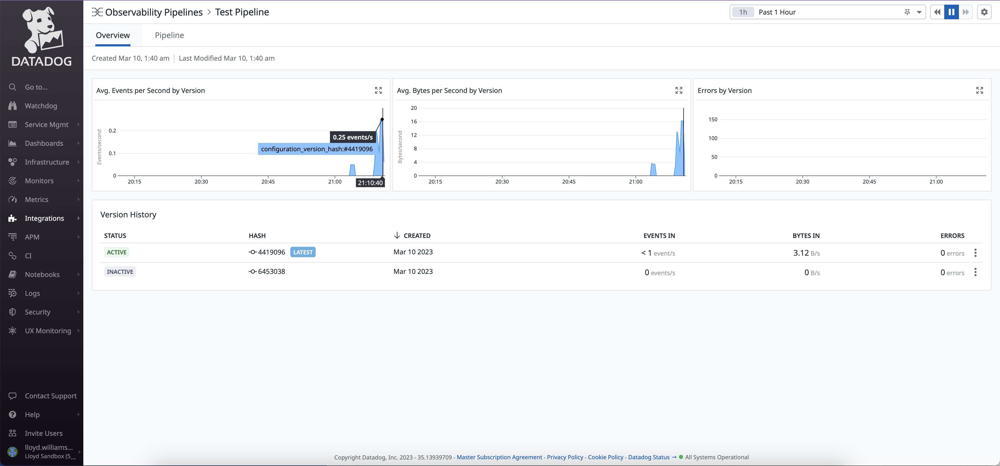
