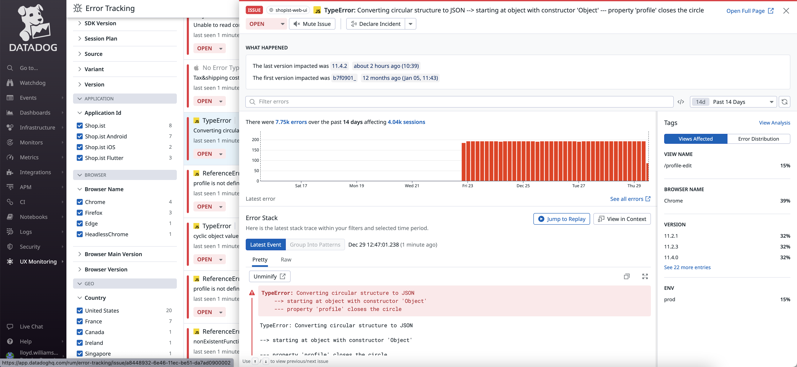
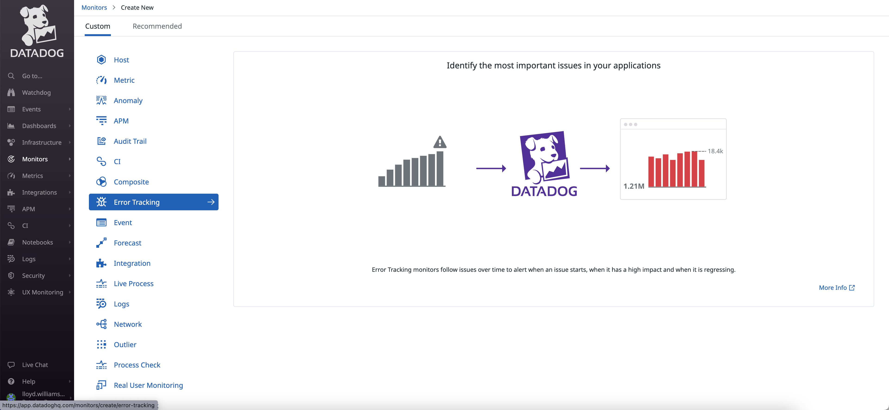
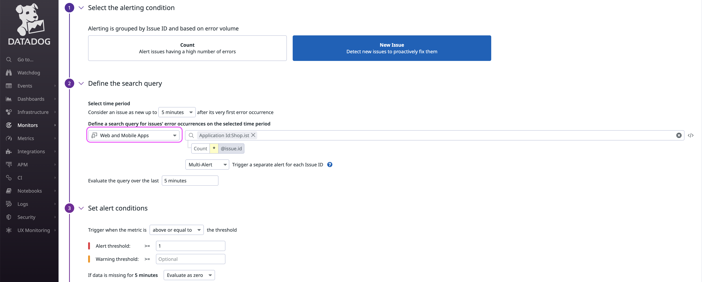
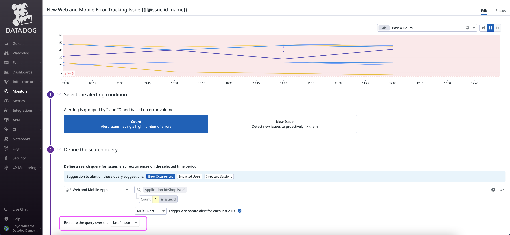
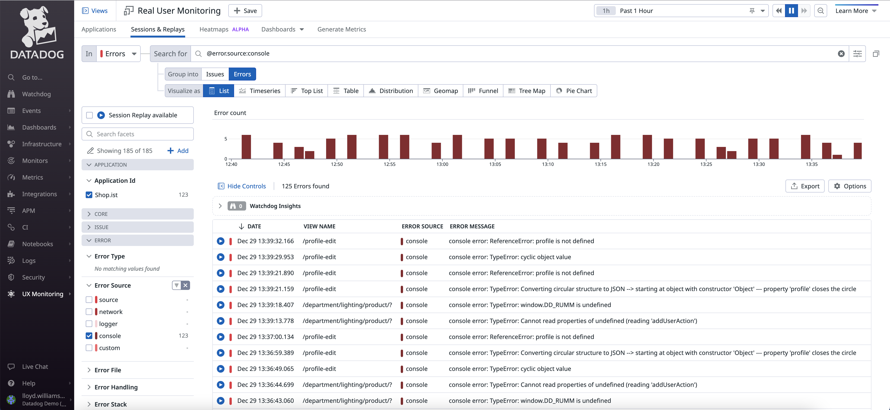
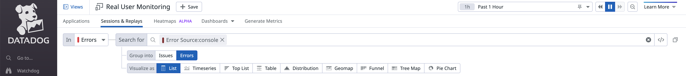
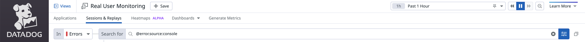
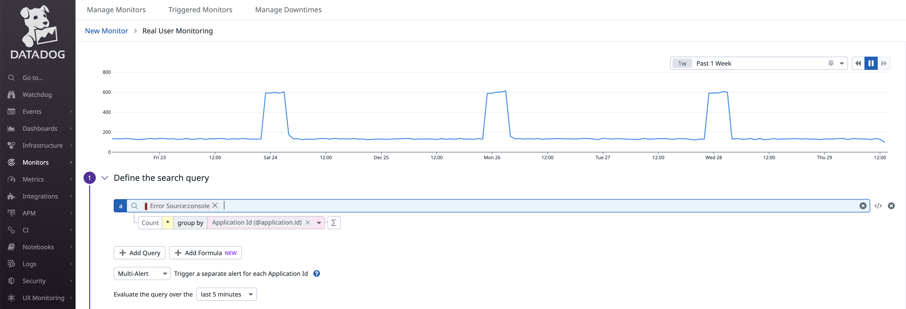
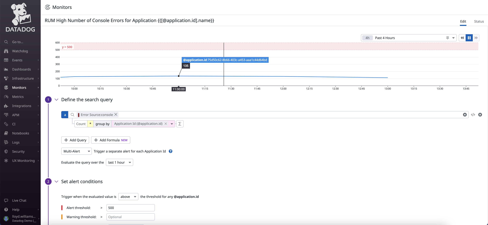
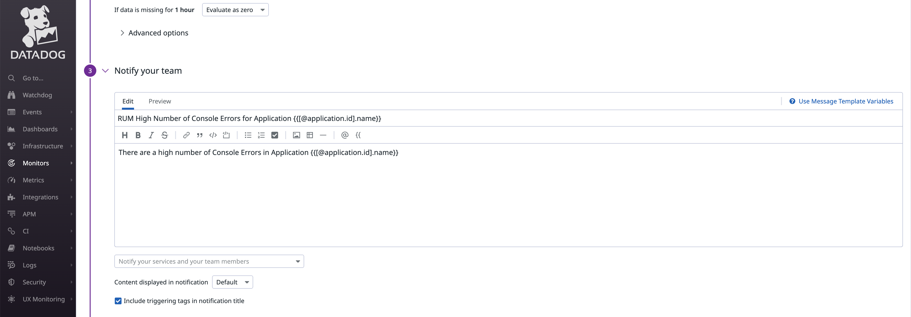

# Datadog RUM Front-End Errors (e.g. JavaScript) 

### **RUM Error Attributes**

[Datadog Docs: RUM Browser Data Collected: Errors](https://docs.datadoghq.com/real_user_monitoring/browser/data_collected/#error-attributes)

| ATTRIBUTE       | TYPE   | DESCRIPTION                                                  |
| --------------- | ------ | ------------------------------------------------------------ |
| `error.source`  | string | Where the error originates from (for example, `console` or `network`). |
| `error.type`    | string | The error type (or error code in some cases).                |
| `error.message` | string | A concise, human-readable, one-line message explaining the event. |
| `error.stack`   | string | The stack trace or complementary information about the error. |

[From Errors to Issues](https://www.datadoghq.com/blog/error-tracking/#from-errors-to-issues)

When Datadog first receives an error event from [Real User Monitoring](https://www.datadoghq.com/product/real-user-monitoring/) (RUM) or APM, it creates a new issue. It then uses the issue to group subsequent errors that have similar messages and stack traces.

## Error Tracking

## Alert when there is a *New Issue* (i.e. Java Script Error)

### Error Tracking Monitor Type

You can use the "Error Tracking" monitor to create an alert when there is an new issue. 

## Alert when an Issue has a High Number of Errors

Be sure to take into account the timeframe for evaluating the query when setting the thresholds.

## RUM Monitor for Console (e.g. JavaScript) Errors

You can also analyze console errors (which are usually JS errors) in the RUM Analytics section. 

Then use this criteria to create a RUM Monitor.

Use the button at the end to change the search bar criteria into the syntax that is needed to define the monitor (e.g. @errror.source:console)

 RUM Monitor

