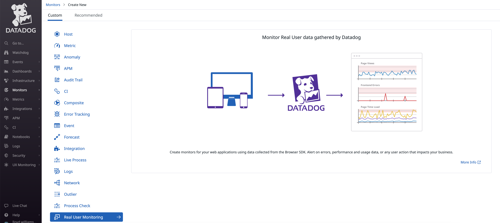
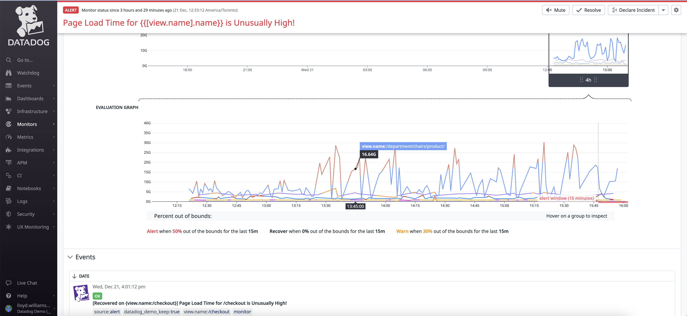

# Datadog RUM Page/View Loading Alerts

[Datadog Docs: Monitoring Page Performance](https://docs.datadoghq.com/real_user_monitoring/browser/monitoring_page_performance/#event-timings-and-core-web-vitals)

## Pre-Built Dashboards for RUM Performance Monitoring

## Alert when page/view load times are too long

### RUM Monitor

You can use the "Real User Monitoring" monitor to create an alert when the average page loading times are above a certain threshold. 

You can scope the monitor to an entire application all at once. 

Choose a timeframe for the average calculation (e.g. 5 minutes, 1 hour) which could affect how noisy the monitor will be. 

You can set an alert threshold or optionally a warning threshold and define appropriate messages for each. 

## Alert when page/view load times out of the normal range

### Anomaly Monitor (Based on a Datadog Metric) 

Since pages will have varying load times depending on their purpose, it might be more useful to have a machine-learning based Anomaly-detection monitor. In order to do this, you will need to use a RUM feature called "Generate Metrics". *Note: this allows you to create your own custom metrics from within the Datadog SaaS UI and additional charges could apply.* 

### Generate a Datadog RUM Metric

Use the **New Metric** button to create a metric with any name that you choose. 

Define the query so that it looks in "Views". It might be a good idea to scope it to a single application. Measure the "Loading Time" and group by @view.name (to make it easier to know which page it refers to).

Optionally, choose Calculate Percentiles, if you think you will use them. 

Once the metrics is created, it will take some time for it to have data. It doesn't go back and historically create this metric data. 

Once the monitor has been active for a while, you will start to see the historical view and evalution view.

Since Anomaly Monitor is a machine-learning based monitor, you don't need to set "page loading" time thresholds. You can hover over the line and it will show what range has been caculated as "normal". 

You may get a lot of alerts in the early stages as the ML model creates an accurate definition of "normal" for each page view.  

You will see a grey area that changes for each view_name corresponding to what is considered within the acceptable range.

Choose "Multi Alert" to be notified separately for each view name. 

You don't need to set page load thresholds, but you can set the bounds and the percentage of values outside the bounds during the time window for the alert to fire. 

The monitor status page will also allow you to see the evolution windows and all of the events that were generated. 

You may not want to alert users on the events until the machine learning algorithm has had a change to set appropriate evalution windows. 

This is then set-up for all the views even if new views are added to the website in the future. 