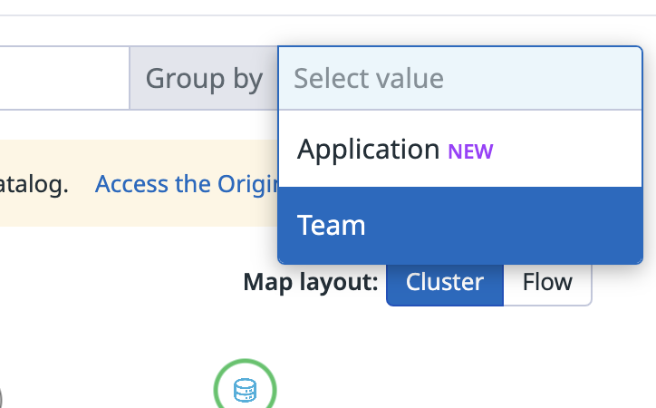
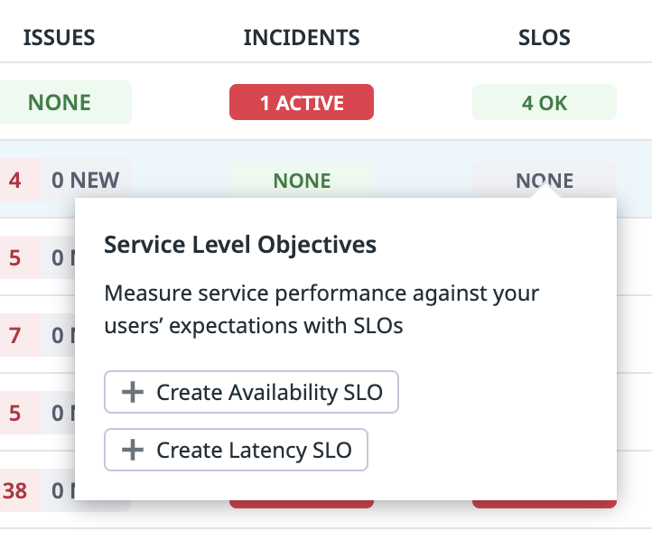
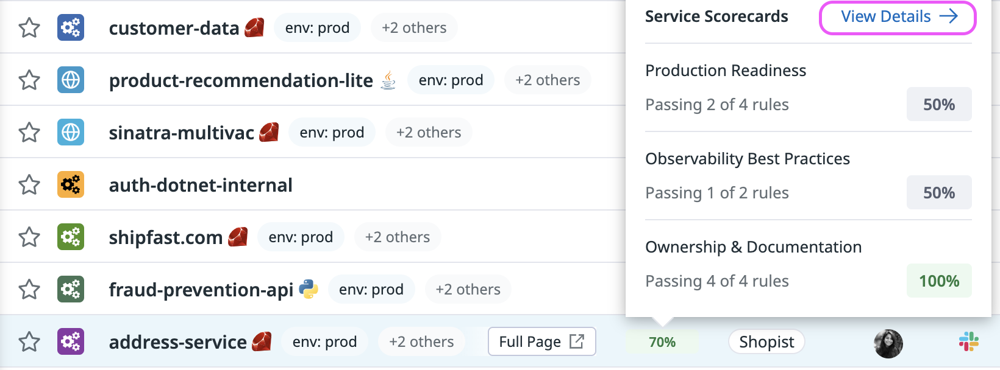
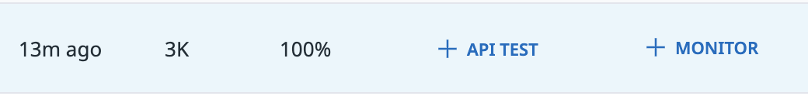
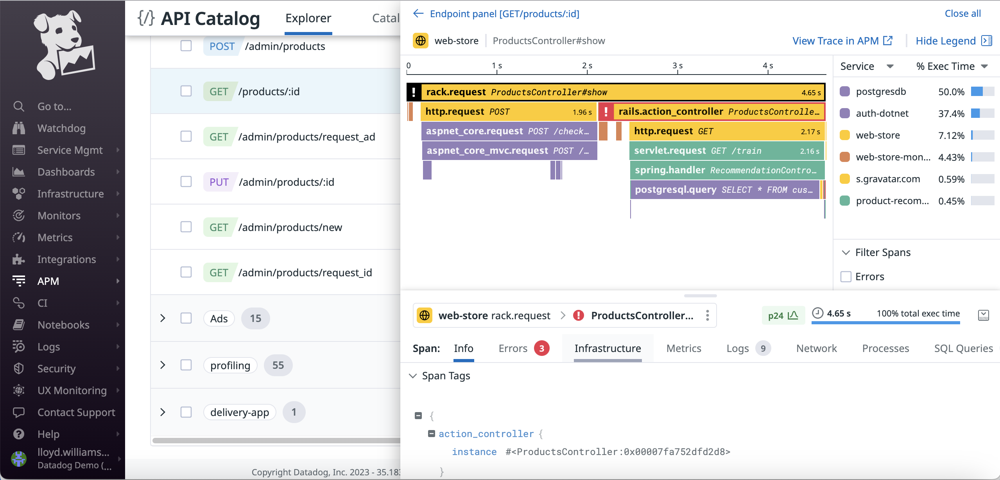

# Datadog Service Governance Demo

Welcome to the Datadog Service Governance demo.

## #1 Infrastructure Map - Containers

https://app.datadoghq.com/infrastructure/map?fillby=avg%3Aprocess.stat.container.cpu.total_pct&groupby=app&mapid=58470&node_type=container

You’ve been transitioning to a more service-oriented architecture.

You see many benefits with the change: 

​	-  teams are moving faster since they’re able to iterate more frequently, leading to greater innovations. 

However, distributed services also means a distributed infrastructure, 

- such as this footprint of all the containers needed to support our distributed stack that runs our e-commerce platform. 

Gray or red means more CPU utilization on the container, which prompts an investigation. 

But it’s difficult to figure out - why there’s more CPU usage - without also factoring in the services that are running on them – and connecting the two isn’t always easy.

## #2 Service Catalog - USM

https://app.datadoghq.com/services?currentTab=Setup%20Guidance&env=prod&groupBy=&hostGroup=%2A&lens=Performance&view=map

**Introducing** Universal Service Monitoring.

*[ Go to Facets on left → Telemetry Type → select ‘Only’ on Universal Service Monitoring ]*

Universal Service Monitoring automatically discovers, maps, and monitors every service running on your infrastructure **and the corresponding APIs** – all without making code changes and without redeploying your apps.

Getting started with Universal Service Monitoring is as **simple** as flipping a switch in the Datadog Agent. 

Under the hood, it works by hooking directly into the Linux kernel using a powerful technology called eBPF. 

Universal Service Monitoring also supports Windows IIS environments, and ensures both security and low-overhead, even for high-throughput microservices. 

You’ll see both microservices that **your team built**: 

[filter team:shopist] then *[Point to “email-api-py” ]*

*[ Click into the team “Services without team”. Hover over “email-api-py” in Shopist. Draw attention to aws.s3 ]*

**as well as 3rd party APIs or cloud native services like AWS S3.**

[ Keep **hovering over a service** so Requests, Latency, and Errors metrics are displayed ]

Every service that Universal Service Monitoring automatically discovers is now covered with consistent health metrics – **throughput, error count, and latency** – meaning you can cover your entire fleet of services with monitors. 

You can also use the arrows that appear --> to understand cross-team dependencies – or which services rely on other services from other teams.

This will help you to identify the cascading impact of any issues and eliminate operational risks, as well.

## #3 Service Catalog - Overview

https://app.datadoghq.com/services?currentTab=Setup%20Guidance&env=prod&groupBy=&hostGroup=%2A&lens=Costs&view=list

Universal Service Monitoring also populates the Service Catalog - **the central hub of all service-related knowledge** - with every service it discovers.

Enabling you to centralize governance and consolidate knowledge *about each service*,

[ Click on Performance tab ]

Like the services’ real-time performance 

[ Click to Security tab ] 

real-time security signals – such as attack attempts, OSS vulnerabilities, and OWASP  Top 10 

*(Open Web Application Security Project)*

[ Click to Ownership tab ]

owners, contact information, and incident response playbooks

[ Click to Reliability tab ]

**Along with SLOs, alerts, and deployments, all in one place.**

[ On the Reliability tab, hover over SLOs column ]

This also makes Service Catalog the perfect place to quickly assess your SLO coverage 

-- And if a gap is identified, the data that’s collected by Universal Service Monitoring is optimal for creating Availability and Latency SLOs with just a few clicks.

## #4 SLOs

[ Go to another tab to [show a created SLO](https://app.datadoghq.com/slo/manage?query=slo_creator%3A"Stephen Pinkerton"&slo_id=5e550a14e2475c3889a33230c3d3aee7&tab=status_and_history&from_ts=1686251365079&to_ts=1686856165079) ]

And for any SLO, you can dive into greater detail such as its status, target value, and remaining error budget, **so you can quickly understand whether you are on track to meet your targets.**

## #5 Service Catalog - Scorecards

[ Go back to previous tab. Use your mouse to point towards ‘Scorecards’ tab. Click on the tab. ]

You can also take a step back and **evaluate your entire system’s production readiness and adherence to best practices at scale** by using Scorecards.

**Scorecards are reports for benchmarking progress in different categories.** 

Right out of the box, you can see categories for:

1. Production Readiness
2. Ownership and Documentation
3. And Observability Best Practices

**Each category** is further subdivided **into a list of investments or pass/fail rules**.

[ Click on the rule ‘SLOs Defined’ ]

This allows you to pinpoint your organization’s progress on any investments–such as a mandate for all Tier 1 services to have at least 1 SLO **configured**.

[ Click on ‘**View** **Failing**’ on "**Shopist**"]

You can also **get a scorecard report across the entire team.**

[ Hover over a Scorecard column entry, and click on ‘View Details’ ]

Or for a specific individual service..

**Giving you the visibility to measure how teams, applications, and services are benchmarking** to **industry** best practices, ownership & documentation **standards**, and **with** production readiness.

**Scorecards** is currently in **private beta** and if you’d like to get early access, please fill out the form [here](http://dtdg.co/scorecards) after the demo.

## #6 API Catalog

[Navigate to the API Catalog under APM]

But what happens when a single service is operated by multiple teams -- like in cases where services run on top of large monolithic applications, application servers or API gateways. 

**We still want to establish governance and accountability** even in the face of more complex ownership models where services are shared and modified by multiple teams. 

**This is where the API Catalog comes in.** 

The API Catalog is **automatically populated with endpoints from Datadog APM**, giving you more granular visibility into every service by breaking them down into the different endpoints or individual APIs. 

**It shows their:**

	-  health and status, 
	-  the monitors that are setup for them, 

- and even the lineage of load generated on every endpoint.

**You can also breakdown service endpoints by team** **to get a better view of who owns what**  so you know who to reach out to when something goes wrong.

[ Group by Teams. Expand "**Ads**" to highlight endpoints belonging to each team]

[ Scroll to the right in the table to see the “Monitors” column ]

**And whenever you need to take action to cover an endpoint** with **a synthetics test or monitors**, you can also do so straight from API Catalog.

[ **Filter to the Orders Team**, click on the GET /products/:id to open the side panel ]

**If you need to further investigate an API**, such as **this GET endpoint that is owned by the “Orders” team** and is responsible for fetching the different products that are being sold, you can drill in it and

[ On the side panel, scroll down on the top half to the dependency map ]

**You will see the endpoints metadata** such as its schema, its performance metrics, and its relationship with other services 

– so you can see which services are calling the endpoint and which services are being called downstream – 

through the dependency map, in a single view.

[ On the side panel, scroll down on the bottom half to show the traces ]

You can also see all the **correlated distributed traces below**, giving you the ability to quickly debug and troubleshoot issues at the request-level from the endpoint’s perspective.

**API Catalog is currently in limited availability, and if you’d like to get early access, please fill out the form here after the demo.**

**So try for yourself, and see how Service Governance** – through Universal Service Monitoring, SLOs, Service Catalog, and **API Catalog** –

**gives** you the foundation to govern all your services and APIs running on top of your infrastructure 

**And can help you simplify and centralize your DevSecOps today.** 

Thank you and I'd be happy to answer any questions that you may have. 

