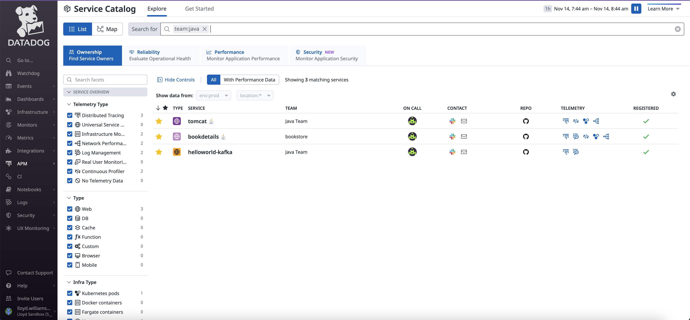
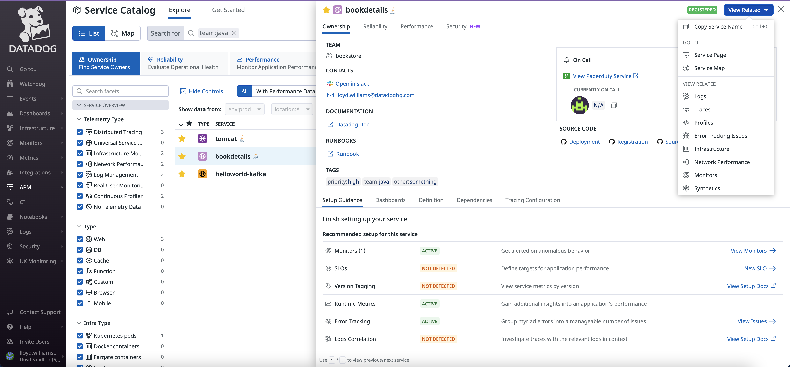
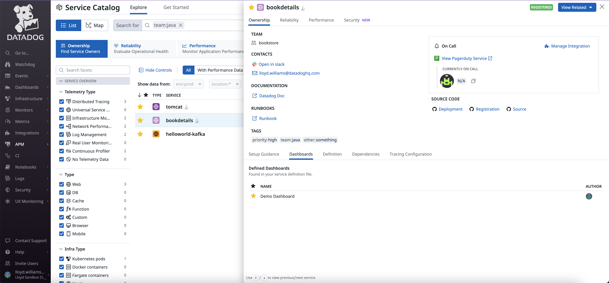
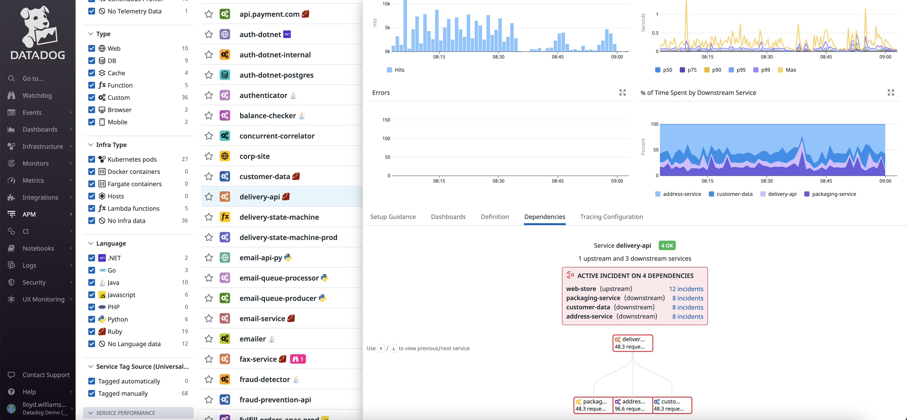
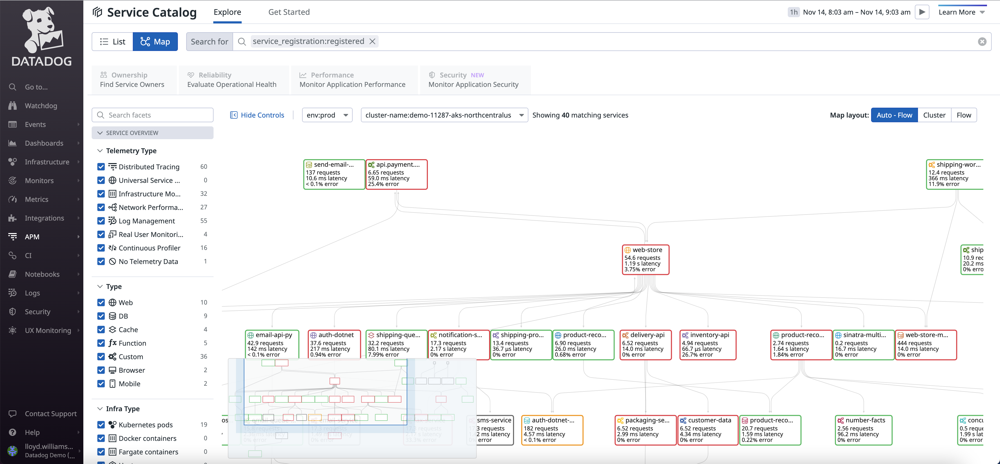

This is an example of registering a service using the Datadog Service Catalog. Please see the following link for instructions. 

[Setting up Service Catalog](https://docs.datadoghq.com/tracing/service_catalog/setup/)

Note that this set-up requires first configuring the [GitHub integration](https://docs.datadoghq.com/integrations/github/). 

This folder contains a sample bash script that uses curl to send the service catalog registration information contained in the yaml file to Datadog so that it appears in the SaaS UI so that users can easily reference useful information about the service. 

Use the Ownership tab and information about the team, on-call staff, contacts, source code repository are available. Users can also easily access from the main page any of the telemetry configured.

Click on a specific service to see more details:

 

Also set-up related dashboards or view service dependencies.

You can also see all of the service dependencies using the "Map" button on the main page of the service catalog.

