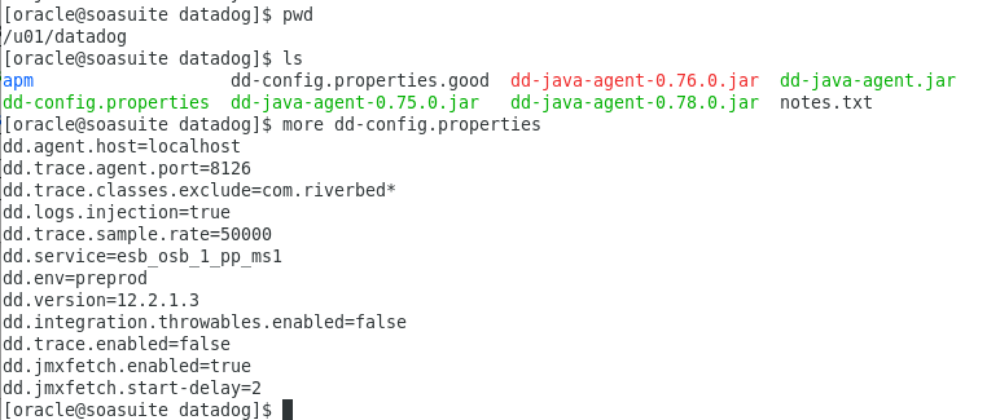
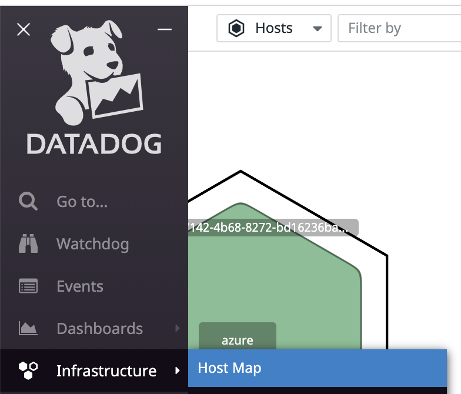

# WebLogic Server on AWS Tracing on RedHat Linux


## Install Datadog Agent

https://docs.datadoghq.com/agent/

Go to "Integrations" ,"Agent" section in the Datadog SaaS to get the instructions to install the agent for RedHat Linux

https://app.datadoghq.com/account/settings#agent

Choose CentOS/Red Hat


Copy the easy one-step install command.

```DD_AGENT_MAJOR_VERSION=7 DD_API_KEY=<<USE YOUR KEY HERE INSTEAD>> DD_SITE="datadoghq.com" bash -c "$(curl -L https://s3.amazonaws.com/dd-agent/scripts/install_script.sh)"```

## API Keys

https://docs.datadoghq.com/account_management/api-app-keys/

Go to the API Keys section in Datadog UI Under Organization Settings https://app.datadoghq.com/organization-settings/api-keys

Give the new key a name 


and choose "Create Key".


Keep your keys a secret for security reasons. (The key shown is for demo purposes only and was immediately revoked).

Replace your key in the one-step command and paste it onto the command line of your RedHat Linux server. 

```DD_AGENT_MAJOR_VERSION=7 DD_API_KEY=3f09a592b66548a0aa6421c5d5a1d36a DD_SITE="datadoghq.com" bash -c "$(curl -L https://s3.amazonaws.com/dd-agent/scripts/install_script.sh)"``

REMEMBER TO USE YOUR OWN **KEY**! (NOT KEY ID)

This will download and install the Datadog agent and set-up yum repositories for future upgrades,


and start it up for first time.


Note it provides the commands for stopping and starting the agent:

If you ever want to stop the Agent, run:

  ```sudo systemctl stop datadog-agent```

And to run it again run:

  ```sudo systemctl start datadog-agent```


## Enable APM on the Datadog Agent

To enable APM for this agent, you will need to change the main agent config file: /etc/datadog-agent/datadog.yaml

Since it's owned by the account dd-agent, you'll need to use: sudo

```sudo vi datadog.yaml```


You'll need to remove the # symbol and 1 space. Note: correct indentation is critcal in yaml.


Optionally, configure an env tag at the top of the datadog.yaml file.


Also, enable logs collection by setting logs_enabled to true.


After these changes are saved. Restart the datadog agent. 

[Agent Commands (datadoghq.com)](https://docs.datadoghq.com/agent/guide/agent-commands/?tab=agentv6v7)

For RedHat Linux, [Basic Agent Usage for Red Hat (datadoghq.com)](https://docs.datadoghq.com/agent/basic_agent_usage/redhat/?tab=agentv6v7)

sudo systemctl restart datadog-agent

To check the status of the running agent after it has re-started, 

sudo datadog-agent status


Also look to see that the logs agent is running:


## Download Datadog APM Java Tracer

For tracing requests through WebLogic Server, we will use the Datadog APM Java Tracer. 

https://docs.datadoghq.com/tracing/setup_overview/setup/java/?tab=otherenvironments

Go to an appropriate folder and Download the 

```shell
wget -O dd-java-agent.jar https://dtdg.co/latest-java-tracer
```

 This will download the latest java-tracing jar file.


You can easily check the version of the Datadog Java Agent by running:

```java -jar dd-java-agent.jar```


## WebLogic APM Java Tracing Set-up

WebLogic Server has the concept of a "domain" which contains startup scripts which starts WebLogic server JVMs.

You will need to configure WebLogic so that it can use the Datadog tracing library. 

The exact place to reference the Datadog tracing library will vary depending on your installation and the product components invovled. 

This will need to be reviewed with your WebLogic Server administrator. 

Ultimately, what you need is for the "dd-java-agent.jar" to be included with the '-javaagent' parameter when the weblogic server starts. 

```text
java -javaagent:/path/to/dd-java-agent.jar -Ddd.profiling.enabled=true -XX:FlightRecorderOptions=stackdepth=256 -Ddd.logs.injection=true -Ddd.trace.sample.rate=1 -Ddd.service=my-app -Ddd.env=staging -jar path/to/your/app.jar -Ddd.version=1.0
```

Some installations have a setStartupEnv.sh file and you may want to put the parameters in the SERVER_SYSTEM_PROPERTIES of the STARTUP_GROUP.


Datadog allows you to specify a file to keep most of the property setting separately, so that they are easier to change. You do this by setting -Ddd.trace.config = the location of the separate config file.  For example,

```-Ddd.trace.config=/u01/datadog/dd-config.properties```

Then put the remaining properties and values that you want to set for Datadog in that file.




You may choose to use the JAVA_OPTIONS env variable (e.g. in startWebLogic.sh)


You can make the changes in the appropriate section:


For basic WebLogic server installations, you should consider configuring  JAVA_OPTIONS in the startWebLogic.sh script in the domain's bin folder.


For implementing Continuous Profiler using Oracle JDKs also use: -XX:+UnlockCommercialFeatures -XX:+FlightRecorder

[Continuous Profiler (datadoghq.com)](https://docs.datadoghq.com/tracing/profiler/)

[Enabling the Java Profiler (datadoghq.com)](https://docs.datadoghq.com/tracing/profiler/enabling/java/)

[Profiler Troubleshooting (datadoghq.com)](https://docs.datadoghq.com/tracing/profiler/profiler_troubleshooting/)

JAVA_AGENT="-javaagent:/u01/datadog/dd-java-agent.jar"

JAVA_OPTIONS="-XX:+UnlockCommercialFeatures -XX:+FlightRecorder -XX:FlightRecorderOptions=stackdepth=256 -Ddd.trace.config=/u01/datadog/dd-config.properties ${SAVE_JAVA_OPTIONS}"

And creating a dd-config.properties file:

Datadog has instrumentation that is off by default for JAX-WS, specifically for endpoints instrumented with @WebService (JAX-WS 1.x) and @WebServiceProvider (JAX-WS 2.x). This was added in version 0.76.0+, and can be enabled with: `DD_INTEGRATION_JAX_WS_ENABLED=true` or -Ddd.integration.jax-ws.enabled=true 

You can set the service name to be defined by the servlet context by setting: -Ddd.trace.split-by-tags=servlet.context

dd.agent.host=localhost
dd.trace.agent.port=8126
dd.service=weblogic
dd.env=dev
dd.version=12.2.1.4
dd.trace.enabled=true
dd.profiling.enabled=true
dd.jmxfetch.enabled=false
dd.logs.injection=true
dd.integration.jax-ws.enabled=true
dd.trace.split-by-tags=servlet.context
#dd.trace.classes.exclude=com.riverbed*
#dd.trace.sample.rate=1.0

For all the parameters and an explanation of their values, see: [Tracing Java Applications (datadoghq.com)](https://docs.datadoghq.com/tracing/setup_overview/setup/java/?tab=websphere#configuration)

## SOAP Requests

When you sent SOAP requests to your application, you should be able to see the APM Traces.


## Infrastructure HostMap

Go to the Infrastructure "HostMap" 



and you should be able to find your instance and see that the Datadog agent is installed.


