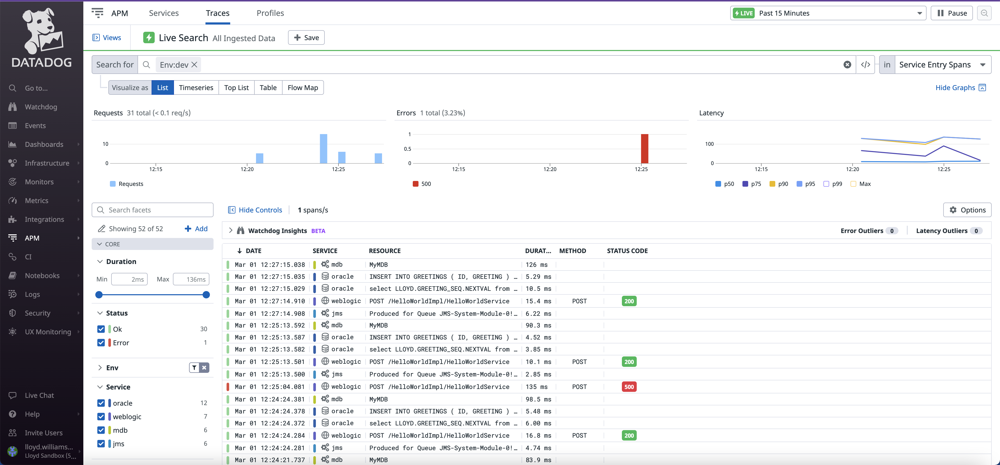
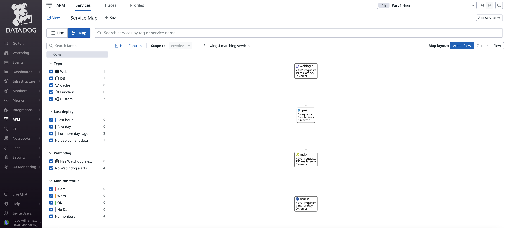
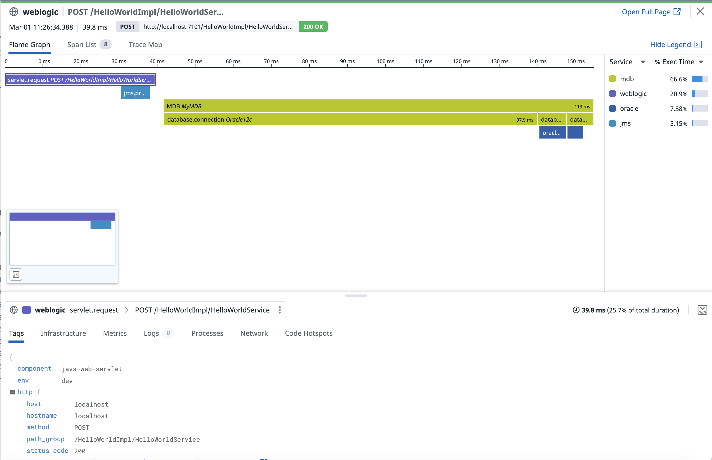
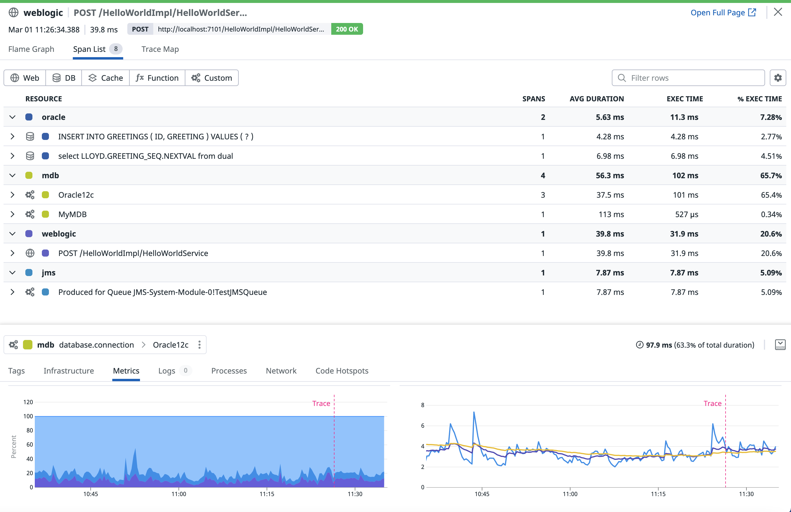
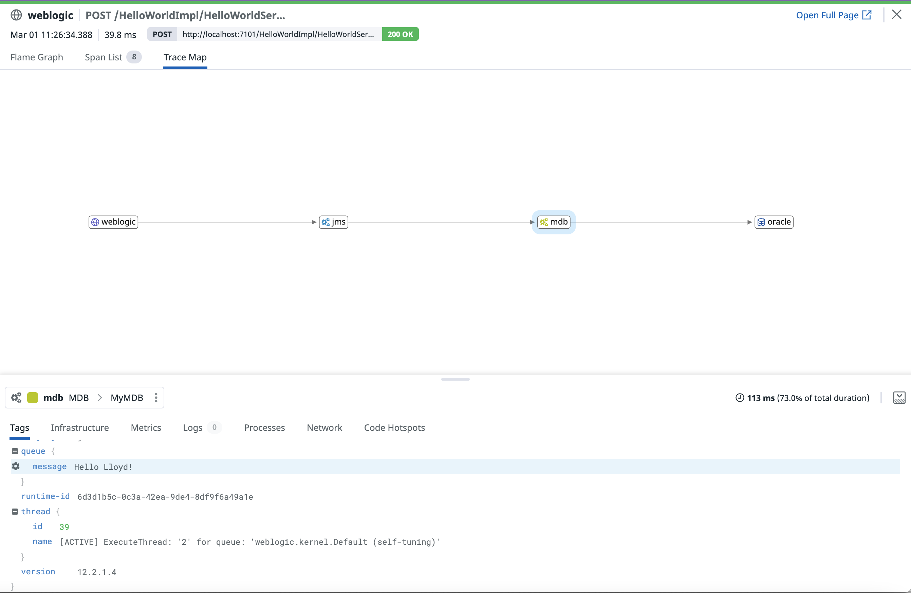

# WebLogic JMS Sample - Datadog Tracing 

This example shows tracing through an applcation that uses HTTP-SOAP to put a JMS message on a WebLogic JMS queue and then an MDB (Java code) takes the message from the queue and sends data to an Oracle database. 

The Service Map shows the relationship between the services.

For each individal request made, there are traces that have a corresponding "Flame Graph".

The "Span List" shows all the spans involved in the trace including details about the database queries used.

Datadog's "Trace Map" shows the flow from the HTTP Request (SOAP) to the JMS Queue (on WebLogic) and a message driven bean (MDB) pulling the message from the JMS queue and then opening a database connection, selecting the next sequence number from the database and then inserting a message into the database using the sequence number and the name that came from the SOAP request and JMS Queue. 

Datadog allows you to use custom code to add any information you have as tags which will be shown in Datadog and can used to help in searching and for analytics purposes.

The main Java code modifications can be found here:

https://github.com/lloydwilliams/datadog/blob/main/weblogic/dd-weblogic-trace-soap-jms-mdb-db/JMSEJB/ejbModule/ejb30/MyMDB.java
https://github.com/lloydwilliams/datadog/blob/main/weblogic/dd-weblogic-trace-soap-jms-mdb-db/JMSEJB/ejbModule/ejb30/MyExtractAdapter.java

