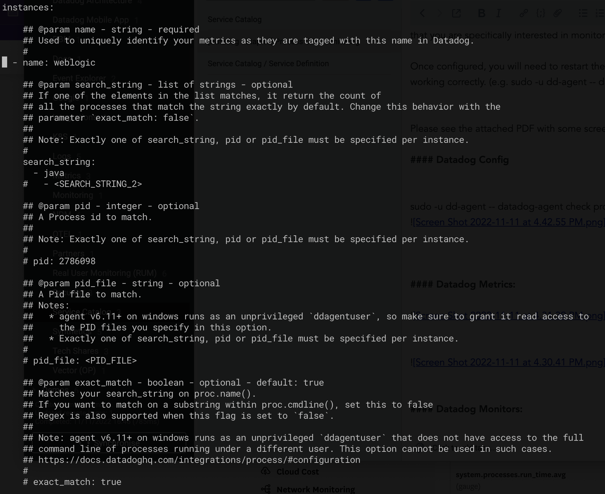
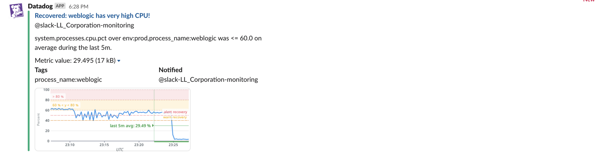
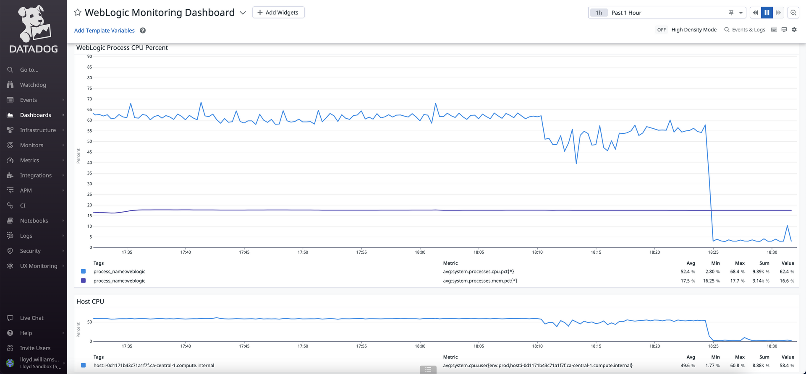

Here is an example of setting up process monitoring for WebLogic:

#### Datadog Config

sudo -u dd-agent -- datadog-agent check process

#### Datadog Metrics:

#### Datadog Monitors:

#### Slack "Warning" when CPU > 60%

*Keep in mind that the monitor in this example has an evaluation window of **5 mins**.
This smoothes out temporary spikes, but you can use a lower time frame to get notified sooner of the process CPU crossing the threshold.*

Slack message when the monitor has recovered

#### APM Service Page:

### APM Monitors:

#### Custom Dashboards:

#### Out-of-the-box Dashboards:

#### Watchdog Insights:

Even without configuring alerts, you many see "Watchdog Insights" pop up in pink in various section of Datadog.

